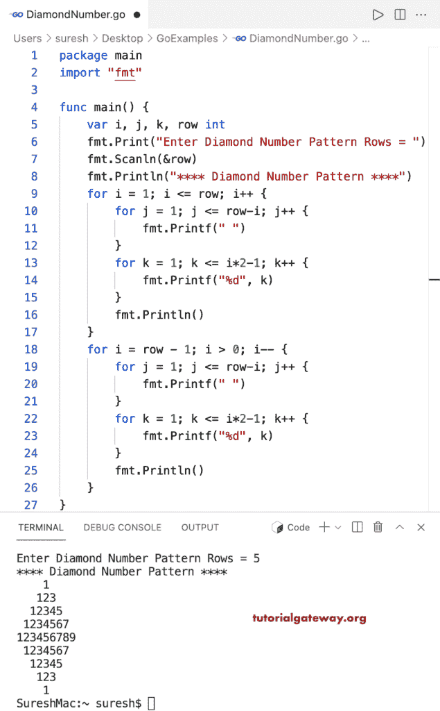

# Go 程序：打印菱形数字图案

> 原文：<https://www.tutorialgateway.org/go-program-to-print-diamond-number-pattern/>

编写一个 Go 程序，使用 for 循环打印菱形数字图案。

```go
package main

import "fmt"

func main() {

	var i, j, k, row int

	fmt.Print("Enter Diamond Number Pattern Rows = ")
	fmt.Scanln(&row)

	fmt.Println("**** Diamond Number Pattern ****")

	for i = 1; i <= row; i++ {
		for j = 1; j <= row-i; j++ {
			fmt.Printf(" ")
		}
		for k = 1; k <= i*2-1; k++ {
			fmt.Printf("%d", k)
		}
		fmt.Println()
	}

	for i = row - 1; i > 0; i-- {
		for j = 1; j <= row-i; j++ {
			fmt.Printf(" ")
		}
		for k = 1; k <= i*2-1; k++ {
			fmt.Printf("%d", k)
		}
		fmt.Println()
	}
}
```



这是编写 [Golang 程序](https://www.tutorialgateway.org/go-programs/)打印数字菱形图案的另一种方法。

```go
package main

import "fmt"

func main() {

	var i, j, k, l, row int

	fmt.Print("Enter Diamond Number Pattern Rows = ")
	fmt.Scanln(&row)

	fmt.Println("**** Diamond Number Pattern ****")

	for i = 1; i <= row; i++ {
		for j = 1; j <= row-i; j++ {
			fmt.Printf(" ")
		}
		for k = i; k >= 1; k-- {
			fmt.Printf("%d", k)
		}
		for l = 2; l <= i; l++ {
			fmt.Printf("%d", l)
		}
		fmt.Println()
	}

	for i = row - 1; i > 0; i-- {
		for j = 1; j <= row-i; j++ {
			fmt.Printf(" ")
		}
		for k = i; k >= 1; k-- {
			fmt.Printf("%d", k)
		}
		for l = 2; l <= i; l++ {
			fmt.Printf("%d", l)
		}
		fmt.Println()
	}
}
```

```go
Enter Diamond Number Pattern Rows = 9
**** Diamond Number Pattern ****
        1
       212
      32123
     4321234
    543212345
   65432123456
  7654321234567
 876543212345678
98765432123456789
 876543212345678
  7654321234567
   65432123456
    543212345
     4321234
      32123
       212
        1
```