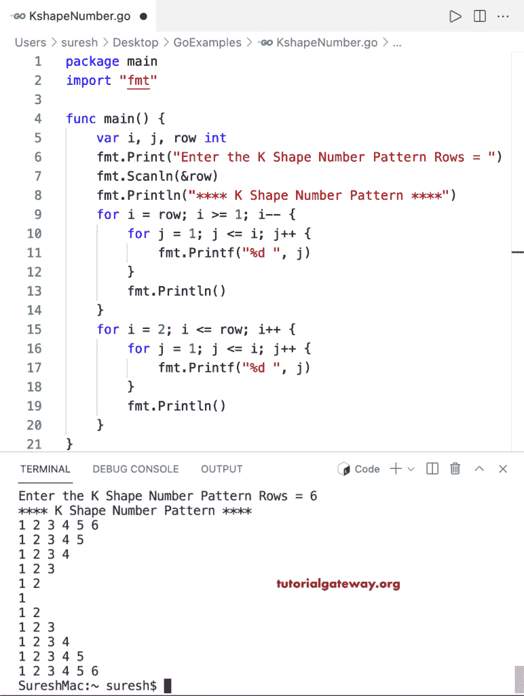

# Go 程序：打印数字的`K`形图案

> 原文：<https://www.tutorialgateway.org/go-program-to-print-k-shape-number-pattern/>

编写一个 Go 程序，打印数字的用于循环的`K`形图案。

```go
package main

import "fmt"

func main() {
	var i, j, row int

	fmt.Print("Enter the K Shape Number Pattern Rows = ")
	fmt.Scanln(&row)

	fmt.Println("**** K Shape Number Pattern ****")

	for i = row; i >= 1; i-- {
		for j = 1; j <= i; j++ {
			fmt.Printf("%d ", j)
		}
		fmt.Println()
	}

	for i = 2; i <= row; i++ {
		for j = 1; j <= i; j++ {
			fmt.Printf("%d ", j)
		}
		fmt.Println()
	}
}
```

