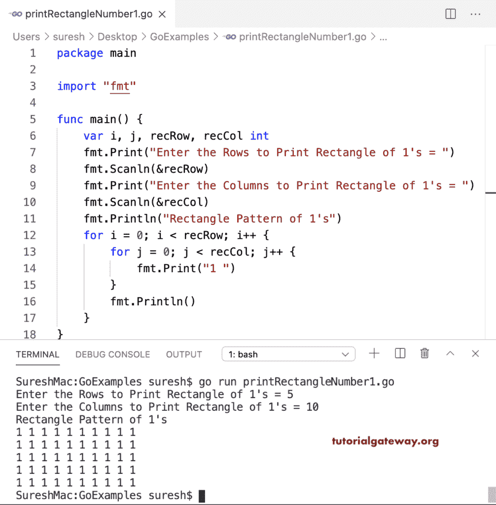

# Go 程序：打印数字的矩形图案

> 原文：<https://www.tutorialgateway.org/go-program-to-print-rectangle-number-pattern/>

编写一个 Go 程序来打印 1 的矩形数字图案。在这个 Golang 矩形数字图案示例中，嵌套 for 循环迭代矩形行和列，并打印一个作为输出。

```go
package main

import "fmt"

func main() {

    var i, j, recRow, recCol int

    fmt.Print("Enter the Rows to Print Rectangle of 1's = ")
    fmt.Scanln(&recRow)

    fmt.Print("Enter the Columns to Print Rectangle of 1's = ")
    fmt.Scanln(&recCol)

    fmt.Println("Rectangle Pattern of 1's")
    for i = 0; i < recRow; i++ {
        for j = 0; j < recCol; j++ {
            fmt.Print("1 ")
        }
        fmt.Println()
    }
}
```



## 打印数字的 0 的矩形图案的 Golang 程序

在这个矩形数字图案的例子中，我们用 1 代替了 0。

```go
package main

import "fmt"

func main() {

    var i, j, recRow, recCol int

    fmt.Print("Enter the Rows to Print Rectangle of 0's = ")
    fmt.Scanln(&recRow)

    fmt.Print("Enter the Columns to Print Rectangle of 0's = ")
    fmt.Scanln(&recCol)

    fmt.Println("Rectangle Pattern of 0's")
    for i = 0; i < recRow; i++ {
        for j = 0; j < recCol; j++ {
            fmt.Print("0 ")
        }
        fmt.Println()
    }
}
```

```go
Enter the Rows to Print Rectangle of 0's = 6
Enter the Columns to Print Rectangle of 0's = 15
Rectangle Pattern of 0's
0 0 0 0 0 0 0 0 0 0 0 0 0 0 0 
0 0 0 0 0 0 0 0 0 0 0 0 0 0 0 
0 0 0 0 0 0 0 0 0 0 0 0 0 0 0 
0 0 0 0 0 0 0 0 0 0 0 0 0 0 0 
0 0 0 0 0 0 0 0 0 0 0 0 0 0 0 
0 0 0 0 0 0 0 0 0 0 0 0 0 0 0 
```

这个 Go 程序允许输入任何数字，并以矩形模式打印该数字。

```go
package main

import "fmt"

func main() {

    var i, j, recRow, recCol, num int

    fmt.Print("Enter the Rows to Print Rectangle of 1's = ")
    fmt.Scanln(&recRow)

    fmt.Print("Enter the Columns to Print Rectangle of 1's = ")
    fmt.Scanln(&recCol)

    fmt.Print("Enter any Number to Print as Rectangle = ")
    fmt.Scanln(&num)

    fmt.Println("Rectangle Pattern of 1's")
    for i = 0; i < recRow; i++ {
        for j = 0; j < recCol; j++ {
            fmt.Printf("%d ", num)
        }
        fmt.Println()
    }
}
```

```go
Enter the Rows to Print Rectangle of 1's = 8
Enter the Columns to Print Rectangle of 1's = 22
Enter any Number to Print as Rectangle = 8
Rectangle Pattern of 1's
8 8 8 8 8 8 8 8 8 8 8 8 8 8 8 8 8 8 8 8 8 8 
8 8 8 8 8 8 8 8 8 8 8 8 8 8 8 8 8 8 8 8 8 8 
8 8 8 8 8 8 8 8 8 8 8 8 8 8 8 8 8 8 8 8 8 8 
8 8 8 8 8 8 8 8 8 8 8 8 8 8 8 8 8 8 8 8 8 8 
8 8 8 8 8 8 8 8 8 8 8 8 8 8 8 8 8 8 8 8 8 8 
8 8 8 8 8 8 8 8 8 8 8 8 8 8 8 8 8 8 8 8 8 8 
8 8 8 8 8 8 8 8 8 8 8 8 8 8 8 8 8 8 8 8 8 8 
8 8 8 8 8 8 8 8 8 8 8 8 8 8 8 8 8 8 8 8 8 8 
```