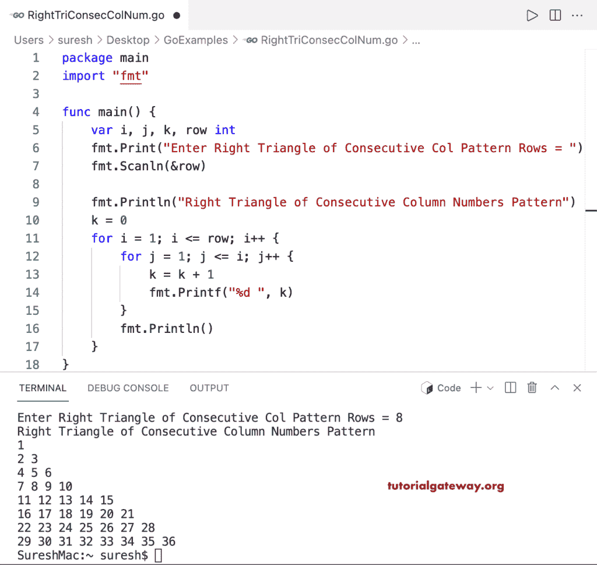

# Go 程序：打印列数字连续的直角三角形

> 原文：<https://www.tutorialgateway.org/go-program-to-print-right-triangle-of-consecutive-column-numbers/>

编写一个 Go 程序，使用 for 循环以直角三角形图案打印连续的列数字。

```go
package main

import "fmt"

func main() {

	var i, j, k, row int

	fmt.Print("Enter Right Triangle of Consecutive Col Pattern Rows = ")
	fmt.Scanln(&row)

	fmt.Println("Right Triangle of Consecutive Column Numbers Pattern")
	k = 0

	for i = 1; i <= row; i++ {
		for j = 1; j <= i; j++ {
			k = k + 1
			fmt.Printf("%d ", k)
		}
		fmt.Println()
	}
}
```

