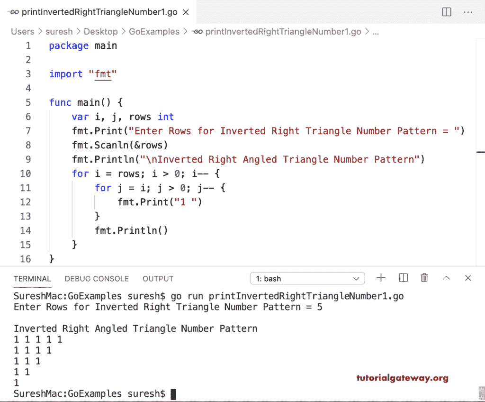

# Go 程序：打印倒直角三角形数字图案

> 原文：<https://www.tutorialgateway.org/go-program-to-print-inverted-right-triangle-number-pattern/>

写一个 Go 程序打印倒直角三角形数字图案。在这个格朗倒直角三角形的例子中，第一个 for 循环从头到尾迭代。第二个用于循环(对于 j = I；j > 0；j –)从 I 迭代到 0。在循环中，我们打印 1。

```go
package main

import "fmt"

func main() {

    var i, j, rows int

    fmt.Print("Enter Rows for Inverted Right Triangle Number Pattern = ")
    fmt.Scanln(&rows)

    fmt.Println("\nInverted Right Angled Triangle Number Pattern")
    for i = rows; i > 0; i-- {
        for j = i; j > 0; j-- {
            fmt.Print("1 ")
        }
        fmt.Println()
    }
}
```



这个 Golang 程序允许输入一个数字，并打印该数字的倒直角三角形图案。

```go
package main

import "fmt"

func main() {

    var i, j, rows, num int

    fmt.Print("Enter Rows for Inverted Right Triangle Number Pattern = ")
    fmt.Scanln(&rows)

    fmt.Print("Inverted Right Triangle NUmber = ")
    fmt.Scanln(&num)

    fmt.Println("\nInverted Right Angled Triangle Number Pattern")
    for i = rows; i > 0; i-- {
        for j = i; j > 0; j-- {
            fmt.Printf("%d ", num)
        }
        fmt.Println()
    }
}
```

```go
Enter Rows for Inverted Right Triangle Number Pattern = 8
Inverted Right Triangle NUmber = 9

Inverted Right Angled Triangle Number Pattern
9 9 9 9 9 9 9 9 
9 9 9 9 9 9 9 
9 9 9 9 9 9 
9 9 9 9 9 
9 9 9 9 
9 9 9 
9 9 
9 
```