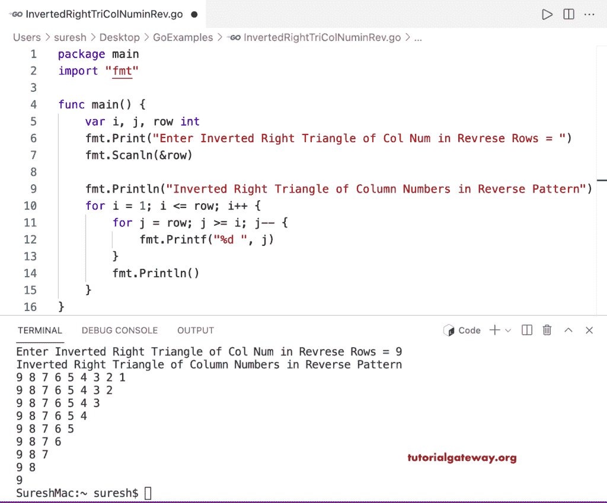

# Go 程序：反向打印列数字的倒直角三角形

> 原文：<https://www.tutorialgateway.org/go-program-to-print-inverted-right-triangle-of-column-numbers-in-reverse/>

编写一个 Go 程序，使用 for 循环以相反的顺序打印列号的倒直角三角形。

```go
package main

import "fmt"

func main() {

	var i, j, row int

	fmt.Print("Enter Inverted Right Triangle of Col Num in Revrese Rows = ")
	fmt.Scanln(&row)

	fmt.Println("Inverted Right Triangle of Column Numbers in Reverse Pattern")

	for i = 1; i <= row; i++ {
		for j = row; j >= i; j-- {
			fmt.Printf("%d ", j)
		}
		fmt.Println()
	}
}
```

