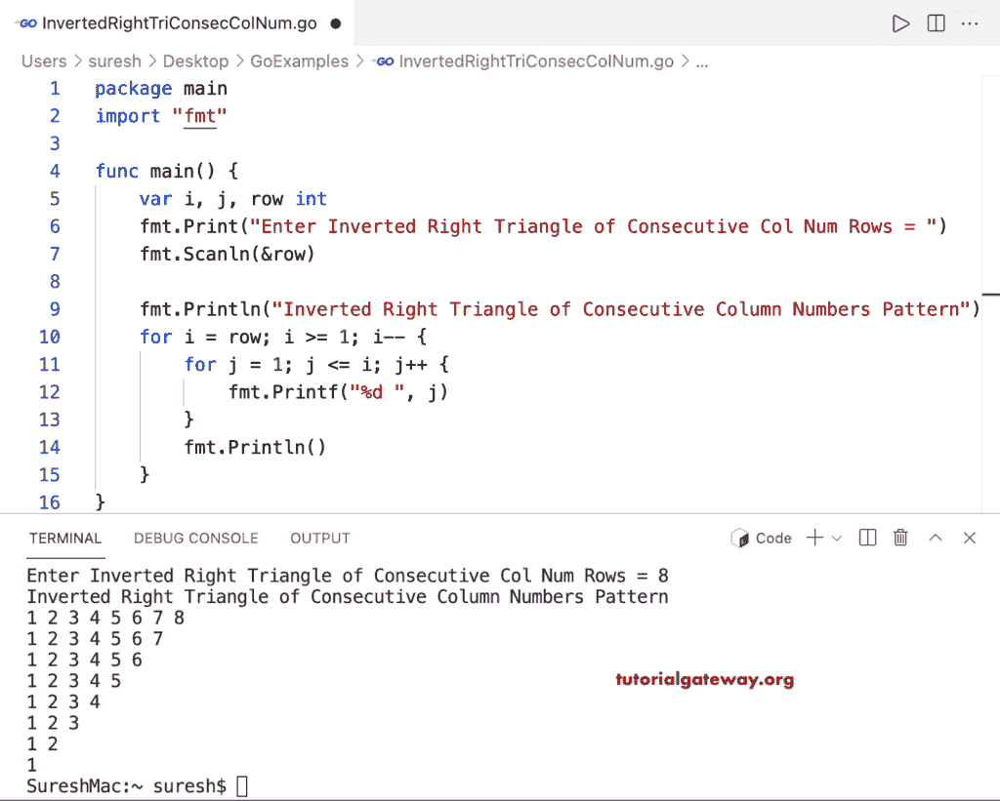

# Go 程序：打印列数字连续的倒直角三角形

> 原文：<https://www.tutorialgateway.org/go-program-to-print-inverted-right-triangle-of-consecutive-column-numbers/>

编写一个 Go 程序，使用 for 循环打印每列中连续数字的倒直角三角形。

```go
package main

import "fmt"

func main() {

	var i, j, row int

	fmt.Print("Enter Inverted Right Triangle of Consecutive Col Num Rows = ")
	fmt.Scanln(&row)

	fmt.Println("Inverted Right Triangle of Consecutive Column Numbers Pattern")

	for i = row; i >= 1; i-- {
		for j = 1; j <= i; j++ {
			fmt.Printf("%d ", j)
		}
		fmt.Println()
	}
}
```

