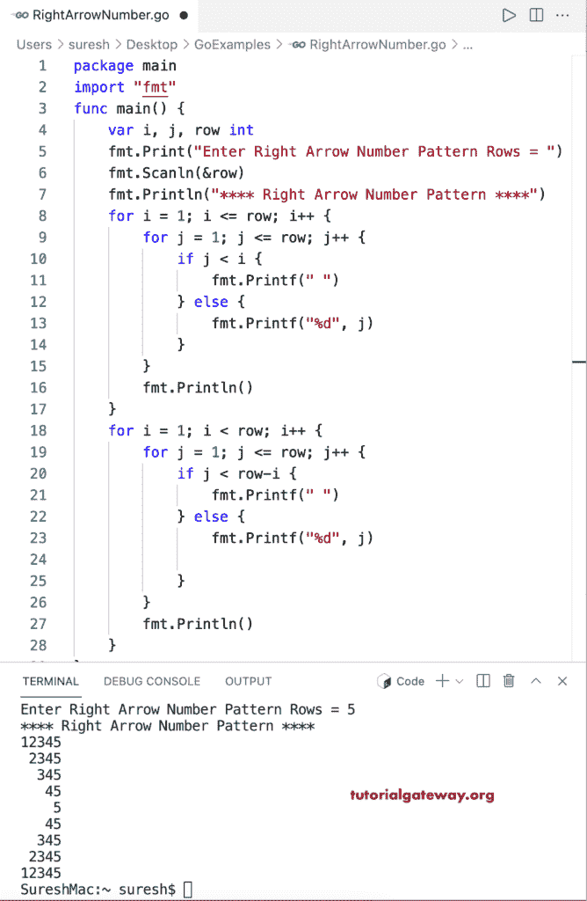

# Go 程序：打印右箭头数字图案

> 原文：<https://www.tutorialgateway.org/go-program-to-print-right-arrow-number-pattern/>

编写一个 Go 程序，打印用于循环的右箭头数字图案。

```go
package main

import "fmt"

func main() {

	var i, j, row int

	fmt.Print("Enter Right Arrow Number Pattern Rows = ")
	fmt.Scanln(&row)

	fmt.Println("**** Right Arrow Number Pattern ****")

	for i = 1; i <= row; i++ {
		for j = 1; j <= row; j++ {
			if j < i {
				fmt.Printf(" ")
			} else {
				fmt.Printf("%d", j)
			}
		}
		fmt.Println()
	}

	for i = 1; i < row; i++ {
		for j = 1; j <= row; j++ {
			if j < row-i {
				fmt.Printf(" ")
			} else {
				fmt.Printf("%d", j)

			}
		}
		fmt.Println()
	}
}
```

