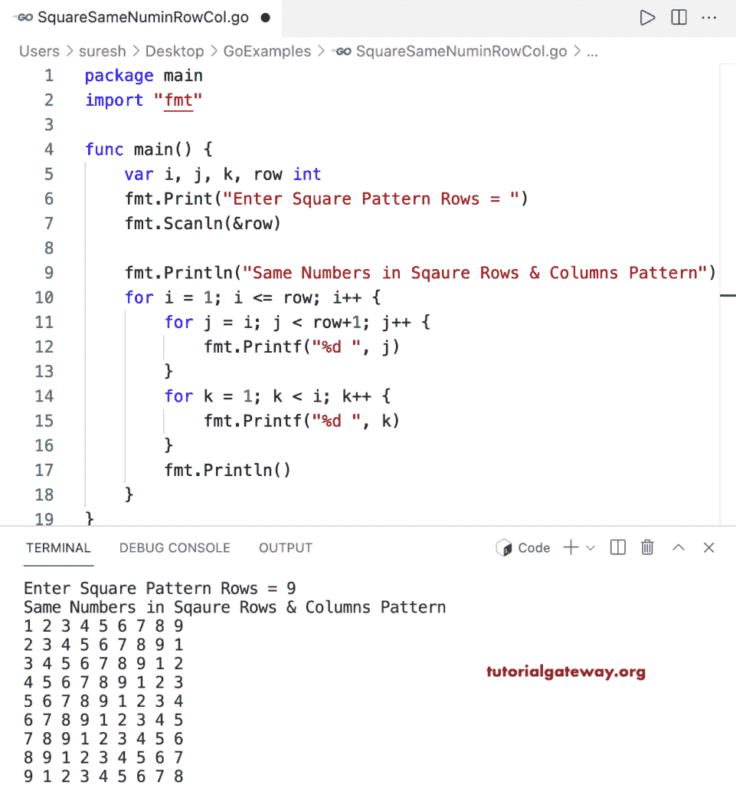

# Go 程序：在正方形行和列中打印相同的数字

> 原文：<https://www.tutorialgateway.org/go-program-to-print-same-numbers-in-square-rows-and-columns/>

编写一个 Go 程序，使用 for 循环在方形数字图案行和列中打印相同的数字。

```go
package main

import "fmt"

func main() {

	var i, j, k, row int

	fmt.Print("Enter Square Pattern Rows = ")
	fmt.Scanln(&row)

	fmt.Println("Same Numbers in Sqaure Rows & Columns Pattern")

	for i = 1; i <= row; i++ {
		for j = i; j < row+1; j++ {
			fmt.Printf("%d ", j)
		}
		for k = 1; k < i; k++ {
			fmt.Printf("%d ", k)
		}
		fmt.Println()
	}
}
```

