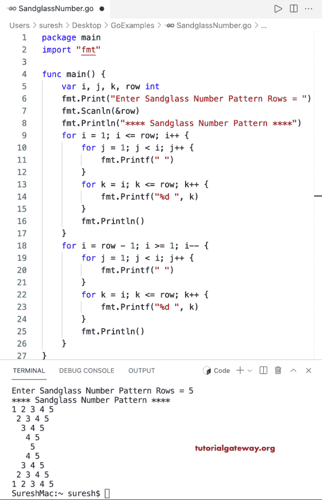

# Go 程序：打印沙漏数字图案

> 原文：<https://www.tutorialgateway.org/go-program-to-print-sandglass-number-pattern/>

编写一个 Go 程序，打印循环使用的沙漏数字图案。

```go
package main

import "fmt"

func main() {

	var i, j, k, row int

	fmt.Print("Enter Sandglass Number Pattern Rows = ")
	fmt.Scanln(&row)

	fmt.Println("**** Sandglass Number Pattern ****")

	for i = 1; i <= row; i++ {
		for j = 1; j < i; j++ {
			fmt.Printf(" ")
		}
		for k = i; k <= row; k++ {
			fmt.Printf("%d ", k)
		}
		fmt.Println()
	}

	for i = row - 1; i >= 1; i-- {
		for j = 1; j < i; j++ {
			fmt.Printf(" ")
		}
		for k = i; k <= row; k++ {
			fmt.Printf("%d ", k)
		}
		fmt.Println()
	}
}
```

