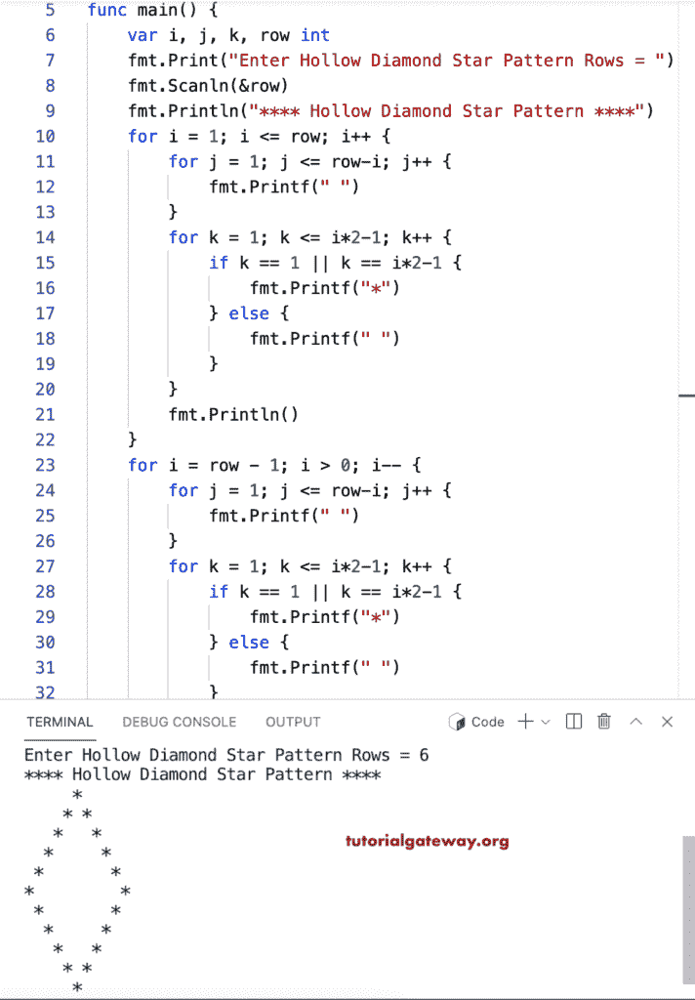

# Go 程序：打印空心钻石星形图案

> 原文：<https://www.tutorialgateway.org/go-program-to-print-hollow-diamond-star-pattern/>

写一个 Go 程序打印空心菱形星形图案，用于循环。

```go
package main

import "fmt"

func main() {

	var i, j, k, row int

	fmt.Print("Enter Hollow Diamond Star Pattern Rows = ")
	fmt.Scanln(&row)

	fmt.Println("**** Hollow Diamond Star Pattern ****")

	for i = 1; i <= row; i++ {
		for j = 1; j <= row-i; j++ {
			fmt.Printf(" ")
		}
		for k = 1; k <= i*2-1; k++ {
			if k == 1 || k == i*2-1 {
				fmt.Printf("*")
			} else {
				fmt.Printf(" ")
			}
		}
		fmt.Println()
	}

	for i = row - 1; i > 0; i-- {
		for j = 1; j <= row-i; j++ {
			fmt.Printf(" ")
		}
		for k = 1; k <= i*2-1; k++ {
			if k == 1 || k == i*2-1 {
				fmt.Printf("*")
			} else {
				fmt.Printf(" ")
			}
		}
		fmt.Println()
	}
}
```



这个 [Go 示例](https://www.tutorialgateway.org/go-programs/)打印给定角色的空心菱形图案。

```go
package main

import (
	"bufio"
	"fmt"
	"os"
)

func main() {

	reader := bufio.NewReader(os.Stdin)

	var i, j, k, row int

	fmt.Print("Enter Hollow Diamond Star Pattern Rows = ")
	fmt.Scanln(&row)

	fmt.Print("Character to Print in Hollow Diamond = ")
	ch, _, _ := reader.ReadRune()

	fmt.Println("Hollow Diamond Pattern")

	for i = 1; i <= row; i++ {
		for j = 1; j <= row-i; j++ {
			fmt.Printf(" ")
		}
		for k = 1; k <= i*2-1; k++ {
			if k == 1 || k == i*2-1 {
				fmt.Printf("%c", ch)
			} else {
				fmt.Printf(" ")
			}
		}
		fmt.Println()
	}

	for i = row - 1; i > 0; i-- {
		for j = 1; j <= row-i; j++ {
			fmt.Printf(" ")
		}
		for k = 1; k <= i*2-1; k++ {
			if k == 1 || k == i*2-1 {
				fmt.Printf("%c", ch)
			} else {
				fmt.Printf(" ")
			}
		}
		fmt.Println()
	}
}
```

```go
Enter Hollow Diamond Star Pattern Rows = 12
Character to Print in Hollow Diamond = $
Hollow Diamond Pattern
           $
          $ $
         $   $
        $     $
       $       $
      $         $
     $           $
    $             $
   $               $
  $                 $
 $                   $
$                     $
 $                   $
  $                 $
   $               $
    $             $
     $           $
      $         $
       $       $
        $     $
         $   $
          $ $
           $
```