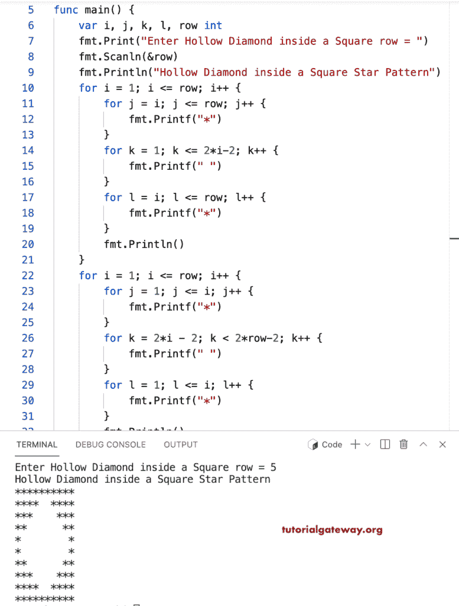

# Go 程序：在方形星形图案中印刷空心钻石

> 原文：<https://www.tutorialgateway.org/go-program-to-print-hollow-diamond-inside-a-square-star-pattern/>

写一个 Go 程序，用 for 循环在正方形图案内打印空心菱形星形图案。

```go
package main

import "fmt"

func main() {

	var i, j, k, l, row int

	fmt.Print("Enter Hollow Diamond inside a Square row = ")
	fmt.Scanln(&row)

	fmt.Println("Hollow Diamond inside a Square Star Pattern")

	for i = 1; i <= row; i++ {
		for j = i; j <= row; j++ {
			fmt.Printf("*")
		}
		for k = 1; k <= 2*i-2; k++ {
			fmt.Printf(" ")
		}
		for l = i; l <= row; l++ {
			fmt.Printf("*")
		}
		fmt.Println()
	}

	for i = 1; i <= row; i++ {
		for j = 1; j <= i; j++ {
			fmt.Printf("*")
		}
		for k = 2*i - 2; k < 2*row-2; k++ {
			fmt.Printf(" ")
		}
		for l = 1; l <= i; l++ {
			fmt.Printf("*")
		}
		fmt.Println()
	}
}
```



这个 [Go 示例](https://www.tutorialgateway.org/go-programs/)在给定角色的正方形图案内打印空心菱形。

```go
package main

import (
	"bufio"
	"fmt"
	"os"
)

func main() {

	reader := bufio.NewReader(os.Stdin)

	var i, j, k, l, row int

	fmt.Print("Enter Hollow Diamond inside a Square row = ")
	fmt.Scanln(&row)

	fmt.Print("Character to Print in Hollow Diamond = ")
	ch, _, _ := reader.ReadRune()

	fmt.Println("Hollow Diamond inside a Square Star Pattern")

	for i = 1; i <= row; i++ {
		for j = i; j <= row; j++ {
			fmt.Printf("%c", ch)
		}
		for k = 1; k <= 2*i-2; k++ {
			fmt.Printf(" ")
		}
		for l = i; l <= row; l++ {
			fmt.Printf("%c", ch)
		}
		fmt.Println()
	}

	for i = 1; i <= row; i++ {
		for j = 1; j <= i; j++ {
			fmt.Printf("%c", ch)
		}
		for k = 2*i - 2; k < 2*row-2; k++ {
			fmt.Printf(" ")
		}
		for l = 1; l <= i; l++ {
			fmt.Printf("%c", ch)
		}
		fmt.Println()
	}
}
```

```go
Enter Hollow Diamond inside a Square row = 14
Character to Print in Hollow Diamond = #
Hollow Diamond inside a Square Star Pattern
############################
#############  #############
############    ############
###########      ###########
##########        ##########
#########          #########
########            ########
#######              #######
######                ######
#####                  #####
####                    ####
###                      ###
##                        ##
#                          #
#                          #
##                        ##
###                      ###
####                    ####
#####                  #####
######                ######
#######              #######
########            ########
#########          #########
##########        ##########
###########      ###########
############    ############
#############  #############
############################
```