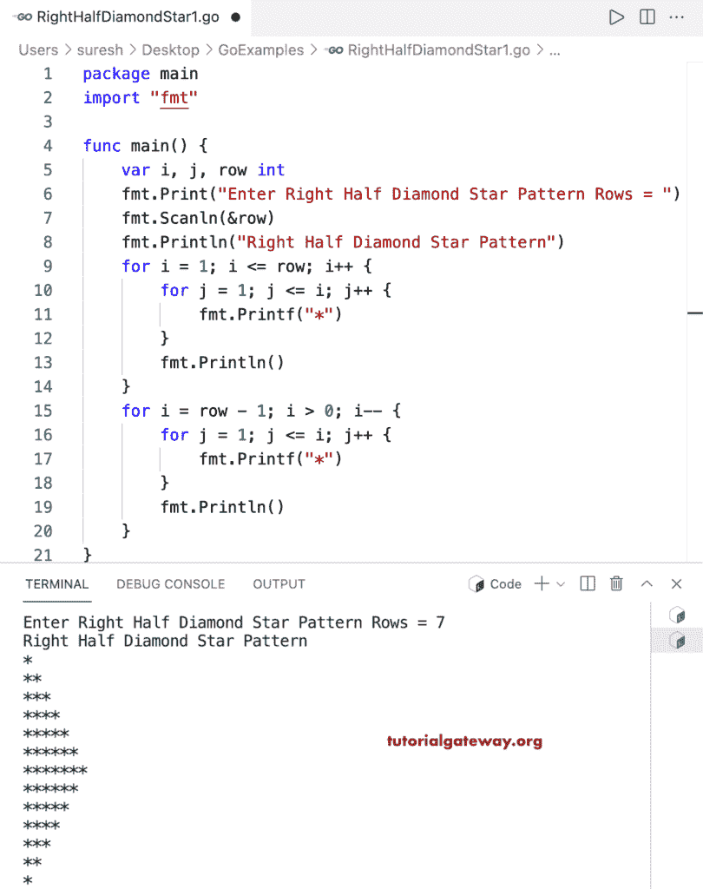

# Go 程序：打印星号的右半菱形图案

> 原文：<https://www.tutorialgateway.org/go-program-to-print-right-half-diamond-star-pattern/>

写一个 Go 程序，用 for 循环打印星号的菱形图案的右半部分。

```go
package main

import "fmt"

func main() {

	var i, j, row int

	fmt.Print("Enter Right Half Diamond Star Pattern Rows = ")
	fmt.Scanln(&row)

	fmt.Println("Right Half Diamond Star Pattern")

	for i = 1; i <= row; i++ {
		for j = 1; j <= i; j++ {
			fmt.Printf("*")
		}
		fmt.Println()
	}

	for i = row - 1; i > 0; i-- {
		for j = 1; j <= i; j++ {
			fmt.Printf("*")
		}
		fmt.Println()
	}
}
```



这个 [Go 示例](https://www.tutorialgateway.org/go-programs/)打印给定角色的右半菱形图案。

```go
package main

import (
	"bufio"
	"fmt"
	"os"
)

func main() {

	reader := bufio.NewReader(os.Stdin)

	var i, j, row int

	fmt.Print("Enter Right Half Diamond  Pattern Rows = ")
	fmt.Scanln(&row)

	fmt.Print("Character to Print in Right Half Diamond = ")
	ch, _, _ := reader.ReadRune()

	fmt.Println("**** Right Half Diamond Pattern ****")

	for i = 1; i <= row; i++ {
		for j = 1; j <= i; j++ {
			fmt.Printf("%c", ch)
		}
		fmt.Println()
	}

	for i = row - 1; i > 0; i-- {
		for j = 1; j <= i; j++ {
			fmt.Printf("%c", ch)
		}
		fmt.Println()
	}
}
```

```go
Enter Right Half Diamond  Pattern Rows = 10
Character to Print in Right Half Diamond = #
**** Right Half Diamond Pattern ****
#
##
###
####
#####
######
#######
########
#########
##########
#########
########
#######
######
#####
####
###
##
#
```