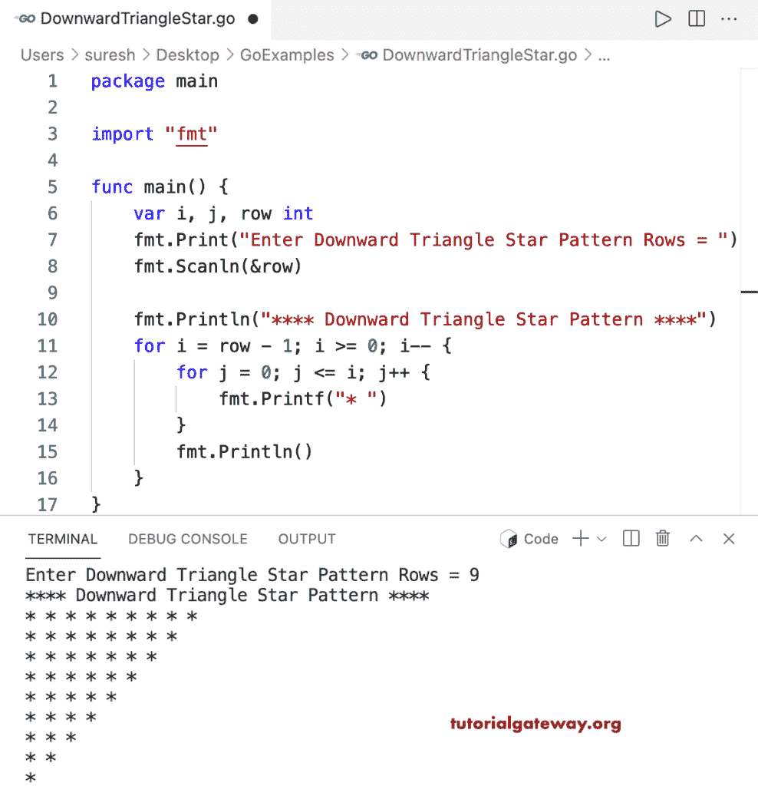

# Go 程序：打印星号的向下三角形图案

> 原文：<https://www.tutorialgateway.org/go-program-to-print-downward-triangle-star-pattern/>

编写一个 Go 程序，使用 for 循环打印星号的向下的三角形图案。

```go
package main

import "fmt"

func main() {

	var i, j, row int

	fmt.Print("Enter Downward Triangle Star Pattern Rows = ")
	fmt.Scanln(&row)

	fmt.Println("**** Downward Triangle Star Pattern ****")

	for i = row - 1; i >= 0; i-- {
		for j = 0; j <= i; j++ {
			fmt.Printf("* ")
		}
		fmt.Println()
	}
}
```



这个 [Golang 示例](https://www.tutorialgateway.org/go-programs/)打印给定字符的向下三角形图案。

```go
package main

import (
	"bufio"
	"fmt"
	"os"
)

func main() {

	reader := bufio.NewReader(os.Stdin)

	var i, j, row int

	fmt.Print("Enter Downward Triangle Pattern Rows = ")
	fmt.Scanln(&row)

	fmt.Print("Enter Character to Print in Downward Triangle = ")
	ch, _, _ := reader.ReadRune()

	fmt.Println("**** Downward Triangle Pattern ****")

	for i = row - 1; i >= 0; i-- {
		for j = 0; j <= i; j++ {
			fmt.Printf("%c ", ch)
		}
		fmt.Println()
	}
}
```

```go
Enter Downward Triangle Pattern Rows = 10
Enter Character to Print in Downward Triangle = $
**** Downward Triangle Pattern ****
$ $ $ $ $ $ $ $ $ $ 
$ $ $ $ $ $ $ $ $ 
$ $ $ $ $ $ $ $ 
$ $ $ $ $ $ $ 
$ $ $ $ $ $ 
$ $ $ $ $ 
$ $ $ $ 
$ $ $ 
$ $ 
$ 
```