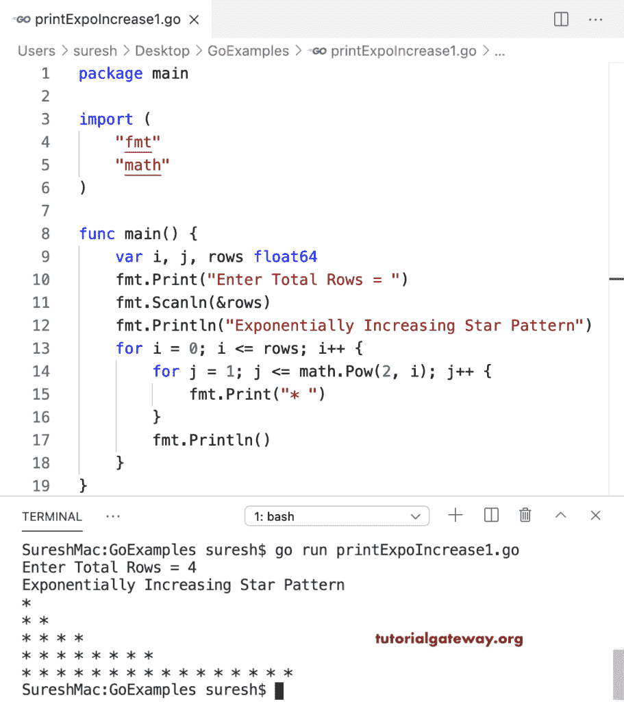

# Go 程序：打印指数增长的星形图案

> 原文：<https://www.tutorialgateway.org/go-program-to-print-exponentially-increased-star-pattern/>

写一个 Go 程序，打印指数增长的星形图案。在这个 Golang 指数增长星形模式的例子中，第一个 for 循环从头到尾迭代。第二个为循环(对于 j = 1；j <=数学。Pow(2，I)；j++)从 1 到 2 次方 I 值迭代。在循环中，我们正在打印星星。

```go
package main

import (
    "fmt"
    "math"
)

func main() {

    var i, j, rows float64

    fmt.Print("Enter Total Rows = ")
    fmt.Scanln(&rows)

    fmt.Println("Exponentially Increasing Star Pattern")
    for i = 0; i <= rows; i++ {
        for j = 1; j <= math.Pow(2, i); j++ {
            fmt.Print("* ")
        }
        fmt.Println()
    }
}
```



这个 Golang 程序允许输入任何符号，并打印该符号的指数增长模式。

```go
package main

import (
    "fmt"
    "math"
)

func main() {

    var i, j, rows float64
    var ch string

    fmt.Print("Enter Total Rows = ")
    fmt.Scanln(&rows)

    fmt.Print("Enter The Symbol = ")
    fmt.Scanln(&ch)

    fmt.Println("Exponentially Increasing Star Pattern")
    for i = 0; i <= rows; i++ {
        for j = 1; j <= math.Pow(2, i); j++ {
            fmt.Printf("%s ", ch)
        }
        fmt.Println()
    }
}
```

```go
Enter Total Rows = 5
Enter The Symbol = $
Exponentially Increasing Star Pattern
$ 
$ $ 
$ $ $ $ 
$ $ $ $ $ $ $ $ 
$ $ $ $ $ $ $ $ $ $ $ $ $ $ $ $ 
$ $ $ $ $ $ $ $ $ $ $ $ $ $ $ $ $ $ $ $ $ $ $ $ $ $ $ $ $ $ $ $ 
```