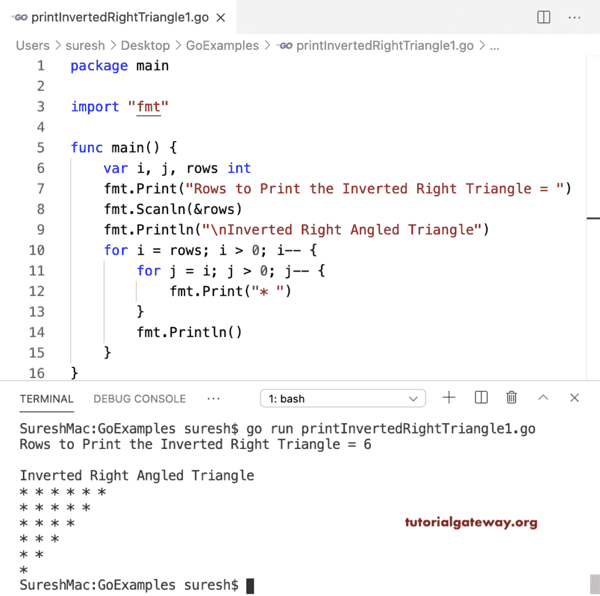

# Go 程序：打印倒直角三角形星形图案

> 原文：<https://www.tutorialgateway.org/go-program-to-print-inverted-right-triangle-star-pattern/>

写一个 Go 程序打印倒直角三角形星形图案。在这个 Golang 倒直角三角形星形示例中，第一个循环从头到尾迭代。第二个(对于 j = I；j > 0；j –)从 I 迭代到 0。在这个循环中，我们打印星星。

```go
package main

import "fmt"

func main() {

    var i, j, rows int

    fmt.Print("Rows to Print the Inverted Right Triangle = ")
    fmt.Scanln(&rows)

    fmt.Println("\nInverted Right Angled Triangle")
    for i = rows; i > 0; i-- {
        for j = i; j > 0; j-- {
            fmt.Print("* ")
        }
        fmt.Println()
    }
}
```



这个 Golang 程序允许我们输入任何符号，并打印给定符号的倒直角三角形图案。

```go
package main

import "fmt"

func main() {

    var i, j, rows int
    var sym string

    fmt.Print("Rows to Print the Inverted Right Triangle = ")
    fmt.Scanln(&rows)

    fmt.Print("Symbol to Print as Inverted Right Triangle = ")
    fmt.Scanln(&sym)

    fmt.Println("\nInverted Right Angled Triangle")
    for i = rows; i > 0; i-- {
        for j = i; j > 0; j-- {
            fmt.Printf("%s ", sym)
        }
        fmt.Println()
    }
}
```

```go
Rows to Print the Inverted Right Triangle = 11
Symbol to Print as Inverted Right Triangle = @

Inverted Right Angled Triangle
@ @ @ @ @ @ @ @ @ @ @ 
@ @ @ @ @ @ @ @ @ @ 
@ @ @ @ @ @ @ @ @ 
@ @ @ @ @ @ @ @ 
@ @ @ @ @ @ @ 
@ @ @ @ @ @ 
@ @ @ @ @ 
@ @ @ @ 
@ @ @ 
@ @ 
@
```