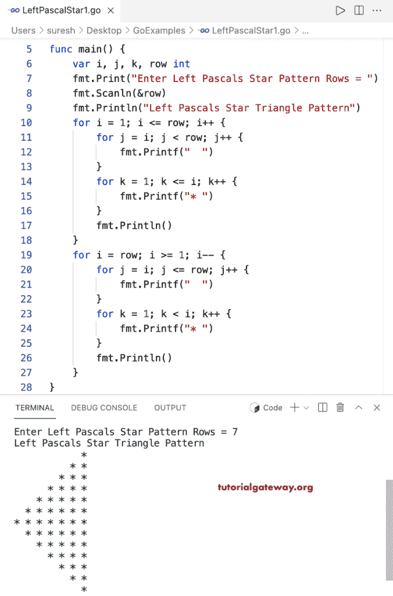

# Go 程序：打印左帕斯卡星形三角形

> 原文：<https://www.tutorialgateway.org/go-program-to-print-left-pascals-star-triangle/>

编写一个 Go 程序，使用 for 循环打印左帕斯卡星形三角形。

```go
package main

import "fmt"

func main() {

	var i, j, k, row int

	fmt.Print("Enter Left Pascals Star Pattern Rows = ")
	fmt.Scanln(&row)

	fmt.Println("Left Pascals Star Triangle Pattern")

	for i = 1; i <= row; i++ {
		for j = i; j < row; j++ {
			fmt.Printf("  ")
		}
		for k = 1; k <= i; k++ {
			fmt.Printf("* ")
		}
		fmt.Println()
	}

	for i = row; i >= 1; i-- {
		for j = i; j <= row; j++ {
			fmt.Printf("  ")
		}
		for k = 1; k < i; k++ {
			fmt.Printf("* ")
		}
		fmt.Println()
	}
}
```



这个 [Go 示例](https://www.tutorialgateway.org/go-programs/)打印给定字符的左帕斯卡三角形图案。

```go
package main

import (
	"bufio"
	"fmt"
	"os"
)

func main() {

	reader := bufio.NewReader(os.Stdin)

	var i, j, k, row int

	fmt.Print("Enter Left Pascals Star Pattern Rows = ")
	fmt.Scanln(&row)

	fmt.Print("Character to Print in Left Pascals Triangle = ")
	ch, _, _ := reader.ReadRune()

	fmt.Println("Left Pascals Star Triangle Pattern")

	for i = 1; i <= row; i++ {
		for j = i; j < row; j++ {
			fmt.Printf("  ")
		}
		for k = 1; k <= i; k++ {
			fmt.Printf("%c ", ch)
		}
		fmt.Println()
	}

	for i = row; i >= 1; i-- {
		for j = i; j <= row; j++ {
			fmt.Printf("  ")
		}
		for k = 1; k < i; k++ {
			fmt.Printf("%c ", ch)
		}
		fmt.Println()
	}
}
```

```go
Enter Left Pascals Star Pattern Rows = 12
Character to Print in Left Pascals Triangle = @
Left Pascals Star Triangle Pattern
                      @ 
                    @ @ 
                  @ @ @ 
                @ @ @ @ 
              @ @ @ @ @ 
            @ @ @ @ @ @ 
          @ @ @ @ @ @ @ 
        @ @ @ @ @ @ @ @ 
      @ @ @ @ @ @ @ @ @ 
    @ @ @ @ @ @ @ @ @ @ 
  @ @ @ @ @ @ @ @ @ @ @ 
@ @ @ @ @ @ @ @ @ @ @ @ 
  @ @ @ @ @ @ @ @ @ @ @ 
    @ @ @ @ @ @ @ @ @ @ 
      @ @ @ @ @ @ @ @ @ 
        @ @ @ @ @ @ @ @ 
          @ @ @ @ @ @ @ 
            @ @ @ @ @ @ 
              @ @ @ @ @ 
                @ @ @ @ 
                  @ @ @ 
                    @ @ 
                      @
```