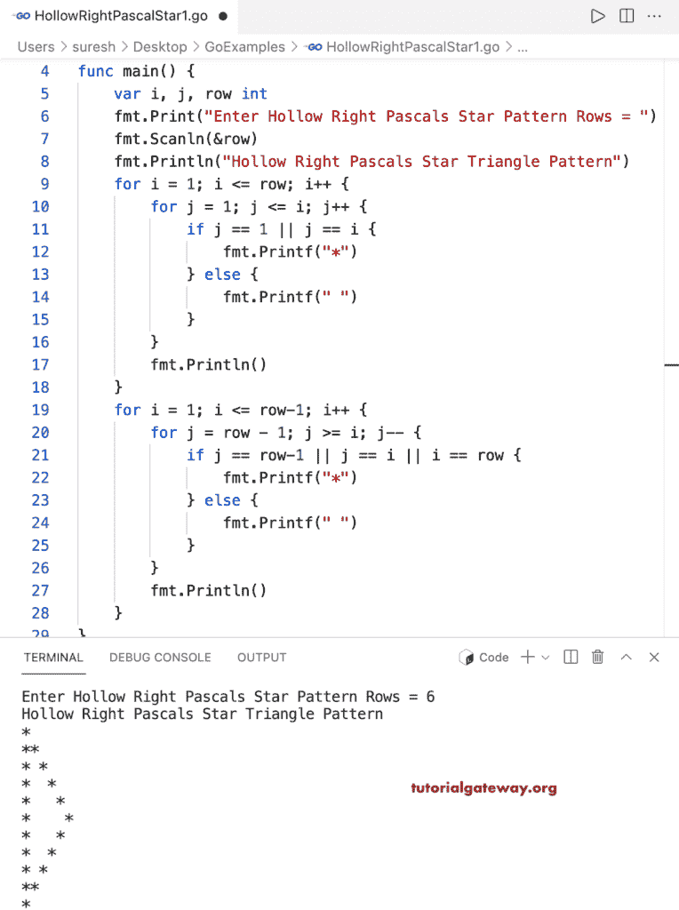

# Go 程序：打印空心直角三角形

> 原文：<https://www.tutorialgateway.org/go-program-to-print-hollow-right-pascals-star-triangle/>

编写一个 Go 程序，打印星号的用于循环的空心直角三角形图案。

```go
package main

import "fmt"

func main() {

	var i, j, row int

	fmt.Print("Enter Hollow Right Pascals Star Pattern Rows = ")
	fmt.Scanln(&row)

	fmt.Println("Hollow Right Pascals Star Triangle Pattern")

	for i = 1; i <= row; i++ {
		for j = 1; j <= i; j++ {
			if j == 1 || j == i {
				fmt.Printf("*")
			} else {
				fmt.Printf(" ")
			}
		}
		fmt.Println()
	}

	for i = 1; i <= row-1; i++ {
		for j = row - 1; j >= i; j-- {
			if j == row-1 || j == i || i == row {
				fmt.Printf("*")
			} else {
				fmt.Printf(" ")
			}
		}
		fmt.Println()
	}
}
```



这个 [Go 示例](https://www.tutorialgateway.org/go-programs/)打印给定字符的空心直角帕斯卡三角形图案。

```go
package main

import (
	"bufio"
	"fmt"
	"os"
)

func main() {

	reader := bufio.NewReader(os.Stdin)

	var i, j, row int

	fmt.Print("Enter Hollow Right Pascals Star Pattern Rows = ")
	fmt.Scanln(&row)

	fmt.Print("Character to Print in Hollow Right Pascals Triangle = ")
	ch, _, _ := reader.ReadRune()

	fmt.Println("Hollow Right Pascals Star Triangle Pattern")

	for i = 1; i <= row; i++ {
		for j = 1; j <= i; j++ {
			if j == 1 || j == i {
				fmt.Printf("%c", ch)
			} else {
				fmt.Printf(" ")
			}
		}
		fmt.Println()
	}

	for i = 1; i <= row-1; i++ {
		for j = row - 1; j >= i; j-- {
			if j == row-1 || j == i || i == row {
				fmt.Printf("%c", ch)
			} else {
				fmt.Printf(" ")
			}
		}
		fmt.Println()
	}
}
```

```go
Enter Hollow Right Pascals Star Pattern Rows = 14
Character to Print in Hollow Right Pascals Triangle = $
Hollow Right Pascals Star Triangle Pattern
$
$$
$ $
$  $
$   $
$    $
$     $
$      $
$       $
$        $
$         $
$          $
$           $
$            $
$           $
$          $
$         $
$        $
$       $
$      $
$     $
$    $
$   $
$  $
$ $
$$
$
```