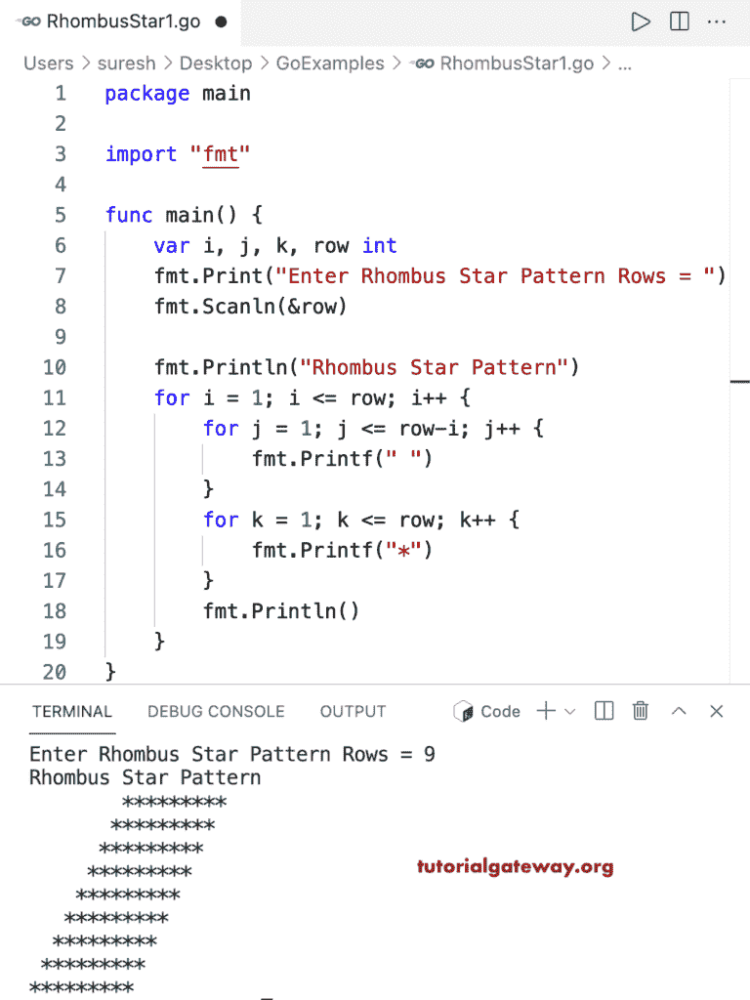

# Go 程序：打印菱形星形图案

> 原文：<https://www.tutorialgateway.org/go-program-to-print-rhombus-star-pattern/>

写一个 Go 程序打印菱形星形图案，用于循环。

```go
package main

import "fmt"

func main() {

	var i, j, k, row int

	fmt.Print("Enter Rhombus Star Pattern Rows = ")
	fmt.Scanln(&row)

	fmt.Println("Rhombus Star Pattern")

	for i = 1; i <= row; i++ {
		for j = 1; j <= row-i; j++ {
			fmt.Printf(" ")
		}
		for k = 1; k <= row; k++ {
			fmt.Printf("*")
		}
		fmt.Println()
	}
}
```



这个 [Go 示例](https://www.tutorialgateway.org/go-programs/)打印给定字符的菱形图案。

```go
package main

import (
	"bufio"
	"fmt"
	"os"
)

func main() {

	reader := bufio.NewReader(os.Stdin)

	var i, j, k, row int

	fmt.Print("Enter Rhombus Star Pattern Rows = ")
	fmt.Scanln(&row)

	fmt.Print("Character to Print in Rhombus = ")
	ch, _, _ := reader.ReadRune()

	fmt.Println("Rhombus Star Pattern")

	for i = 1; i <= row; i++ {
		for j = 1; j <= row-i; j++ {
			fmt.Printf("  ")
		}
		for k = 1; k <= row; k++ {
			fmt.Printf("%c ", ch)
		}
		fmt.Println()
	}
}
```

```go
Enter Rhombus Star Pattern Rows = 14
Character to Print in Rhombus = #
Rhombus Star Pattern
                          # # # # # # # # # # # # # # 
                        # # # # # # # # # # # # # # 
                      # # # # # # # # # # # # # # 
                    # # # # # # # # # # # # # # 
                  # # # # # # # # # # # # # # 
                # # # # # # # # # # # # # # 
              # # # # # # # # # # # # # # 
            # # # # # # # # # # # # # # 
          # # # # # # # # # # # # # # 
        # # # # # # # # # # # # # # 
      # # # # # # # # # # # # # # 
    # # # # # # # # # # # # # # 
  # # # # # # # # # # # # # # 
# # # # # # # # # # # # # # 
```