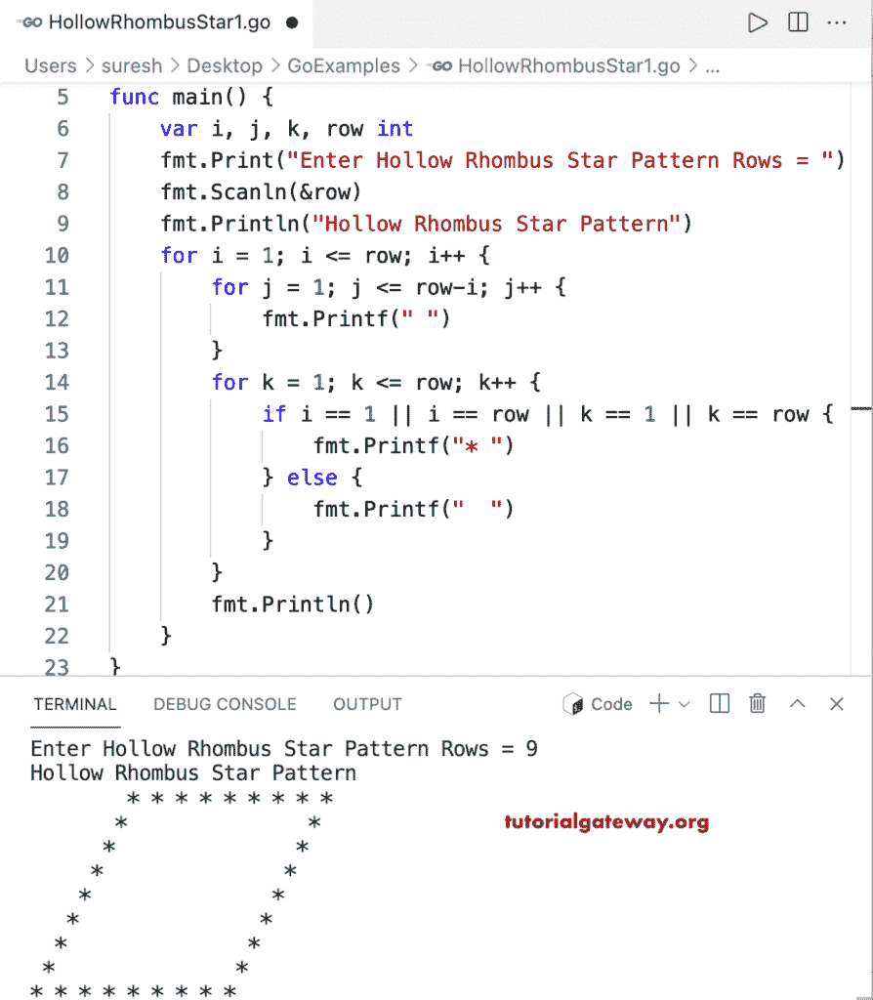

# Go 程序：打印星号的空心菱形图案

> 原文：<https://www.tutorialgateway.org/go-program-to-print-hollow-rhombus-star-pattern/>

写一个 Go 程序打印星号的空心菱形图案用于循环。

```go
package main

import "fmt"

func main() {

	var i, j, k, row int

	fmt.Print("Enter Hollow Rhombus Star Pattern Rows = ")
	fmt.Scanln(&row)

	fmt.Println("Hollow Rhombus Star Pattern")

	for i = 1; i <= row; i++ {
		for j = 1; j <= row-i; j++ {
			fmt.Printf(" ")
		}
		for k = 1; k <= row; k++ {
			if i == 1 || i == row || k == 1 || k == row {
				fmt.Printf("* ")
			} else {
				fmt.Printf("  ")
			}
		}
		fmt.Println()
	}
}
```



此 [Go 示例](https://www.tutorialgateway.org/go-programs/)打印给定字符的空心菱形图案。

```go
package main

import (
	"bufio"
	"fmt"
	"os"
)

func main() {

	reader := bufio.NewReader(os.Stdin)

	var i, j, k, row int

	fmt.Print("Enter Hollow Rhombus Star Pattern Rows = ")
	fmt.Scanln(&row)

	fmt.Print("Character to Print in Hollow Rhombus  = ")
	ch, _, _ := reader.ReadRune()

	fmt.Println("Hollow Rhombus Pattern")

	for i = 1; i <= row; i++ {
		for j = 1; j <= row-i; j++ {
			fmt.Printf(" ")
		}
		for k = 1; k <= row; k++ {
			if i == 1 || i == row || k == 1 || k == row {
				fmt.Printf("%c ", ch)
			} else {
				fmt.Printf("  ")
			}
		}
		fmt.Println()
	}
}
```

```go
Enter Hollow Rhombus Star Pattern Rows = 12
Character to Print in Hollow Rhombus = $
Hollow Rhombus Pattern
           $ $ $ $ $ $ $ $ $ $ $ $ 
          $                     $ 
         $                     $ 
        $                     $ 
       $                     $ 
      $                     $ 
     $                     $ 
    $                     $ 
   $                     $ 
  $                     $ 
 $                     $ 
$ $ $ $ $ $ $ $ $ $ $ $ 
```