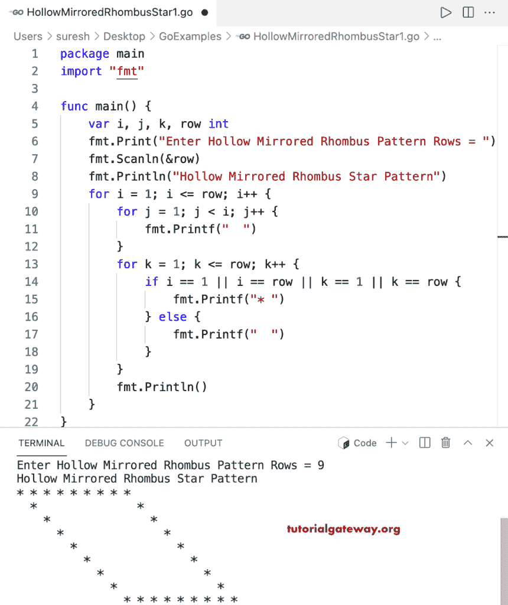

# Go 程序：打印星号的空心镜像菱形图案

> 原文：<https://www.tutorialgateway.org/go-program-to-print-hollow-mirrored-rhombus-star-pattern/>

写一个 Go 程序打印星号的空心镜像菱形图案，用于循环。

```go
package main

import "fmt"

func main() {

	var i, j, k, row int

	fmt.Print("Enter Hollow Mirrored Rhombus Pattern Rows = ")
	fmt.Scanln(&row)

	fmt.Println("Hollow Mirrored Rhombus Star Pattern")

	for i = 1; i <= row; i++ {
		for j = 1; j < i; j++ {
			fmt.Printf("  ")
		}
		for k = 1; k <= row; k++ {
			if i == 1 || i == row || k == 1 || k == row {
				fmt.Printf("* ")
			} else {
				fmt.Printf("  ")
			}
		}
		fmt.Println()
	}
}
```



这个 [Go 示例](https://www.tutorialgateway.org/go-programs/)打印给定角色的空心镜像菱形图案。

```go
package main

import (
	"bufio"
	"fmt"
	"os"
)

func main() {

	reader := bufio.NewReader(os.Stdin)

	var i, j, k, row int

	fmt.Print("Enter Hollow Mirrored Rhombus Pattern Rows = ")
	fmt.Scanln(&row)

	fmt.Print("Character to Print in Hollow Mirrored Rhombus = ")
	ch, _, _ := reader.ReadRune()

	fmt.Println("Hollow Mirrored Rhombus Pattern")

	for i = 1; i <= row; i++ {
		for j = 1; j < i; j++ {
			fmt.Printf("  ")
		}
		for k = 1; k <= row; k++ {
			if i == 1 || i == row || k == 1 || k == row {
				fmt.Printf("%c ", ch)
			} else {
				fmt.Printf("  ")
			}
		}
		fmt.Println()
	}
}
```

```go
Enter Hollow Mirrored Rhombus Pattern Rows = 14
Character to Print in Hollow Mirrored Rhombus = #
Hollow Mirrored Rhombus Pattern
# # # # # # # # # # # # # # 
  #                         # 
    #                         # 
      #                         # 
        #                         # 
          #                         # 
            #                         # 
              #                         # 
                #                         # 
                  #                         # 
                    #                         # 
                      #                         # 
                        #                         # 
                          # # # # # # # # # # # # # # 
```