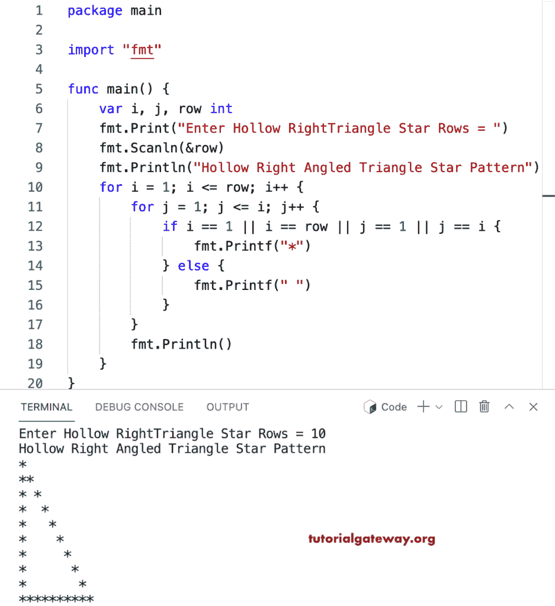

# Go 程序：打印星号的空心直角三角形图案

> 原文：<https://www.tutorialgateway.org/go-program-to-print-hollow-right-angled-triangle-star-pattern/>

写一个 Go 程序打印星号的空心直角三角形图案，用于循环。

```go
package main

import "fmt"

func main() {

	var i, j, row int

	fmt.Print("Enter Hollow RightTriangle Star Rows = ")
	fmt.Scanln(&row)

	fmt.Println("Hollow Right Angled Triangle Star Pattern")

	for i = 1; i <= row; i++ {
		for j = 1; j <= i; j++ {
			if i == 1 || i == row || j == 1 || j == i {
				fmt.Printf("*")
			} else {
				fmt.Printf(" ")
			}
		}
		fmt.Println()
	}
}
```



这个 [Go 示例](https://www.tutorialgateway.org/go-programs/)打印给定字符的空心直角三角形图案。

```go
package main

import (
	"bufio"
	"fmt"
	"os"
)

func main() {

	reader := bufio.NewReader(os.Stdin)

	var i, j, row int

	fmt.Print("Enter Hollow Right Triangle Star Rows = ")
	fmt.Scanln(&row)

	fmt.Print("Character to Print in Hollow Right Triangle = ")
	ch, _, _ := reader.ReadRune()

	fmt.Println("Hollow Right Angled Triangle Star Pattern")

	for i = 1; i <= row; i++ {
		for j = 1; j <= i; j++ {
			if i == 1 || i == row || j == 1 || j == i {
				fmt.Printf("%c", ch)
			} else {
				fmt.Printf(" ")
			}
		}
		fmt.Println()
	}
}
```

```go
Enter Hollow Right Triangle Star Rows = 15
Character to Print in Hollow Right Triangle = #
Hollow Right Angled Triangle Star Pattern
#
##
# #
#  #
#   #
#    #
#     #
#      #
#       #
#        #
#         #
#          #
#           #
#            #
###############
```