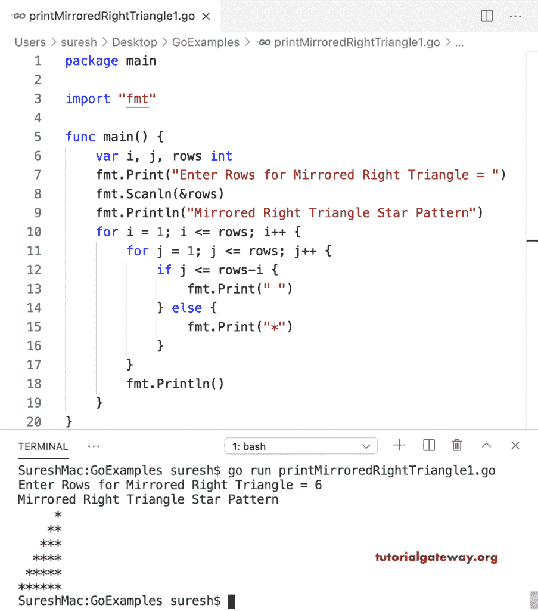

# Go 程序：打印镜像直角三角形图案

> 原文：<https://www.tutorialgateway.org/go-program-to-print-mirrored-right-triangle-pattern/>

写一个 Go 程序来打印镜像直角三角形星形图案。在这个 Golang 镜像直角三角形的例子中，循环的嵌套从行的开始到结束迭代。if 语句(如果 j <= rows-i)检查列是否小于或等于 rows-i。如果为 True，则打印空白；否则，它会打印星星。

```go
package main

import "fmt"

func main() {

    var i, j, rows int

    fmt.Print("Enter Rows for Mirrored Right Triangle = ")
    fmt.Scanln(&rows)

    fmt.Println("Mirrored Right Triangle Star Pattern")
    for i = 1; i <= rows; i++ {
        for j = 1; j <= rows; j++ {
            if j <= rows-i {
                fmt.Print(" ")
            } else {
                fmt.Print("*")
            }
        }
        fmt.Println()
    }
}
```



这个 Golang 程序允许输入一个字符串符号，并打印该符号的镜像直角三角形图案。

```go
package main

import "fmt"

func main() {

    var i, j, rows int
    var ch string

    fmt.Print("Enter Rows for Mirrored Right Triangle = ")
    fmt.Scanln(&rows)

    fmt.Print("Enter Symbol for Mirrored Right Triangle = ")
    fmt.Scanln(&ch)

    fmt.Println("Mirrored Right Triangle Pattern")
    for i = 1; i <= rows; i++ {
        for j = 1; j <= rows; j++ {
            if j <= rows-i {
                fmt.Print(" ")
            } else {
                fmt.Printf("%s", ch)
            }
        }
        fmt.Println()
    }
}
```

```go
Enter Rows for Mirrored Right Triangle = 10
Enter Symbol for Mirrored Right Triangle = $
Mirrored Right Triangle Pattern
         $
        $$
       $$$
      $$$$
     $$$$$
    $$$$$$
   $$$$$$$
  $$$$$$$$
 $$$$$$$$$
$$$$$$$$$$
```