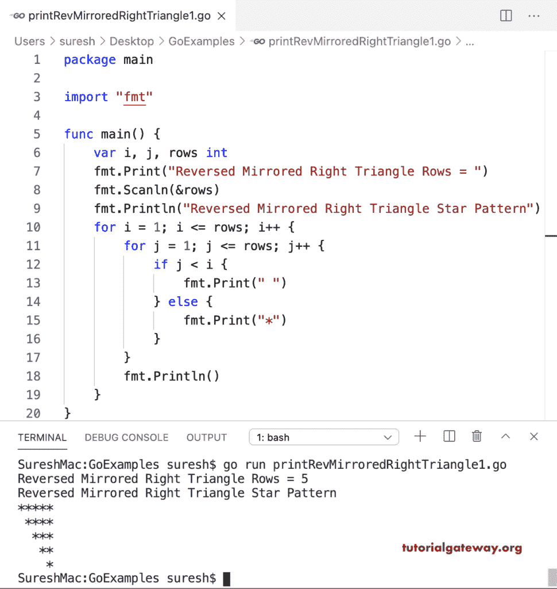

# Go 程序：打印星号的反向镜像直角三角形图案

> 原文：<https://www.tutorialgateway.org/go-program-to-print-reversed-mirrored-right-triangle-pattern/>

写一个 Go 程序打印星号的反向镜像直角三角形图案。在这个 Golang 反向镜像直角三角形示例中，嵌套 for 循环从头到尾迭代行。if 语句(if j < i)检查列值是否小于行。如果为真，则打印空白；否则，打印星星。

```go
package main

import "fmt"

func main() {

    var i, j, rows int

    fmt.Print("Reversed Mirrored Right Triangle Rows = ")
    fmt.Scanln(&rows)

    fmt.Println("Reversed Mirrored Right Triangle Star Pattern")
    for i = 1; i <= rows; i++ {
        for j = 1; j <= rows; j++ {
            if j < i {
                fmt.Print(" ")
            } else {
                fmt.Print("*")
            }
        }
        fmt.Println()
    }
}
```



这个 Golang 程序允许输入一个符号，并以反向镜像直角三角形模式打印该符号。

```go
package main

import "fmt"

func main() {

    var i, j, rows int
    var ch string

    fmt.Print("Rows for Reversed Mirrored Right Triangle = ")
    fmt.Scanln(&rows)

    fmt.Print("Symbol for Reversed Mirrored Right Triangle = ")
    fmt.Scanln(&ch)

    fmt.Println("Reversed Mirrored Right Triangle Pattern")
    for i = 1; i <= rows; i++ {
        for j = 1; j <= rows; j++ {
            if j < i {
                fmt.Print(" ")
            } else {
                fmt.Printf("%s", ch)
            }
        }
        fmt.Println()
    }
}
```

```go
Rows for Reversed Mirrored Right Triangle = 11
Symbol for Reversed Mirrored Right Triangle = #
Reversed Mirrored Right Triangle Pattern
###########
 ##########
  #########
   ########
    #######
     ######
      #####
       ####
        ###
         ##
          #
```