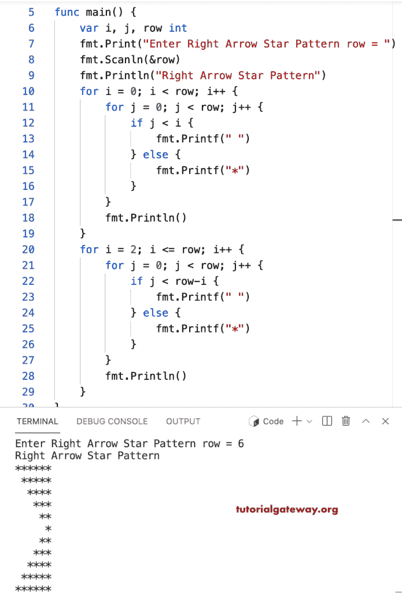

# Go 程序：打印星号的右箭头图案

> 原文：<https://www.tutorialgateway.org/go-program-to-print-right-arrow-star-pattern/>

编写一个 Go 程序，打印星号的用于循环的右箭头图案。

```go
package main

import "fmt"

func main() {

	var i, j, row int

	fmt.Print("Enter Right Arrow Star Pattern row = ")
	fmt.Scanln(&row)

	fmt.Println("Right Arrow Star Pattern")

	for i = 0; i < row; i++ {
		for j = 0; j < row; j++ {
			if j < i {
				fmt.Printf(" ")
			} else {
				fmt.Printf("*")
			}
		}
		fmt.Println()
	}

	for i = 2; i <= row; i++ {
		for j = 0; j < row; j++ {
			if j < row-i {
				fmt.Printf(" ")
			} else {
				fmt.Printf("*")
			}
		}
		fmt.Println()
	}
}
```



这个 [Go 示例](https://www.tutorialgateway.org/go-programs/)打印给定字符的右箭头图案。

```go
package main

import (
	"bufio"
	"fmt"
	"os"
)

func main() {

	reader := bufio.NewReader(os.Stdin)

	var i, j, row int

	fmt.Print("Enter Right Arrow Star Pattern row = ")
	fmt.Scanln(&row)

	fmt.Print("Character to Print in Right Arrow = ")
	ch, _, _ := reader.ReadRune()

	fmt.Println("Right Arrow Star Pattern")

	for i = 0; i < row; i++ {
		for j = 0; j < row; j++ {
			if j < i {
				fmt.Printf(" ")
			} else {
				fmt.Printf("%c", ch)
			}
		}
		fmt.Println()
	}

	for i = 2; i <= row; i++ {
		for j = 0; j < row; j++ {
			if j < row-i {
				fmt.Printf(" ")
			} else {
				fmt.Printf("%c", ch)
			}
		}
		fmt.Println()
	}
}
```

```go
Enter Right Arrow Star Pattern row = 12
Character to Print in Right Arrow = $
Right Arrow Star Pattern
$$$$$$$$$$$$
 $$$$$$$$$$$
  $$$$$$$$$$
   $$$$$$$$$
    $$$$$$$$
     $$$$$$$
      $$$$$$
       $$$$$
        $$$$
         $$$
          $$
           $
          $$
         $$$
        $$$$
       $$$$$
      $$$$$$
     $$$$$$$
    $$$$$$$$
   $$$$$$$$$
  $$$$$$$$$$
 $$$$$$$$$$$
$$$$$$$$$$$$
```