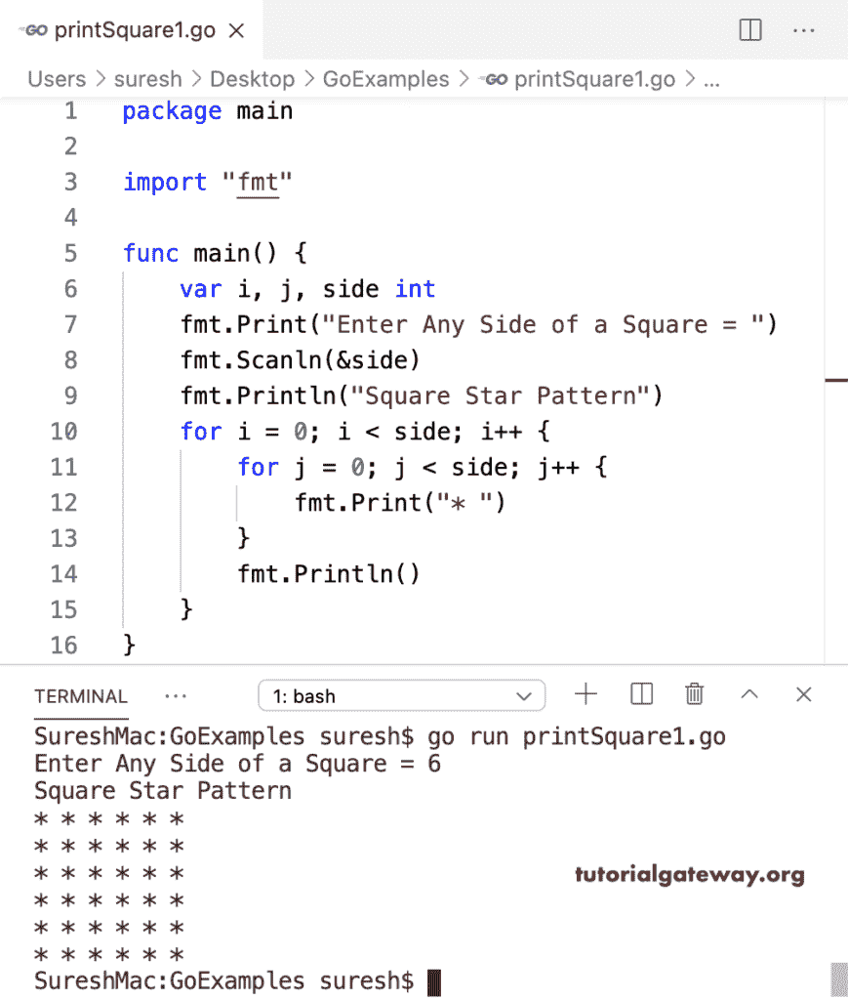

# Go 程序：打印方形星形图案

> 原文：<https://www.tutorialgateway.org/go-program-to-print-square-star-pattern/>

写一个 Go 程序来打印方形星形图案。在这个 Golang Square 星型模式示例中，嵌套 for 循环迭代正方形边。在这个循环中，我们打印出正方形的星星。

```go
package main

import "fmt"

func main() {

    var i, j, side int

    fmt.Print("Enter Any Side of a Square = ")
    fmt.Scanln(&side)

    fmt.Println("Square Star Pattern")
    for i = 0; i < side; i++ {
        for j = 0; j < side; j++ {
            fmt.Print("* ")
        }
        fmt.Println()
    }
}
```



这个 Go 程序允许输入任何符号，并打印带有该符号的方形图案。

```go
package main

import "fmt"

func main() {

    var i, j, side int
    var ch string

    fmt.Print("Enter Any Side of a Square = ")
    fmt.Scanln(&side)

    fmt.Print("Symbol to Print the Square Pattern = ")
    fmt.Scanln(&ch)

    fmt.Println("Square Star Pattern")
    for i = 0; i < side; i++ {
        for j = 0; j < side; j++ {
            fmt.Printf("%s ", ch)
        }
        fmt.Println()
    }
}
```

```go
Enter Any Side of a Square = 10
Symbol to Print the Square Pattern = $
Square Star Pattern
$ $ $ $ $ $ $ $ $ $ 
$ $ $ $ $ $ $ $ $ $ 
$ $ $ $ $ $ $ $ $ $ 
$ $ $ $ $ $ $ $ $ $ 
$ $ $ $ $ $ $ $ $ $ 
$ $ $ $ $ $ $ $ $ $ 
$ $ $ $ $ $ $ $ $ $ 
$ $ $ $ $ $ $ $ $ $ 
$ $ $ $ $ $ $ $ $ $ 
$ $ $ $ $ $ $ $ $ $
```