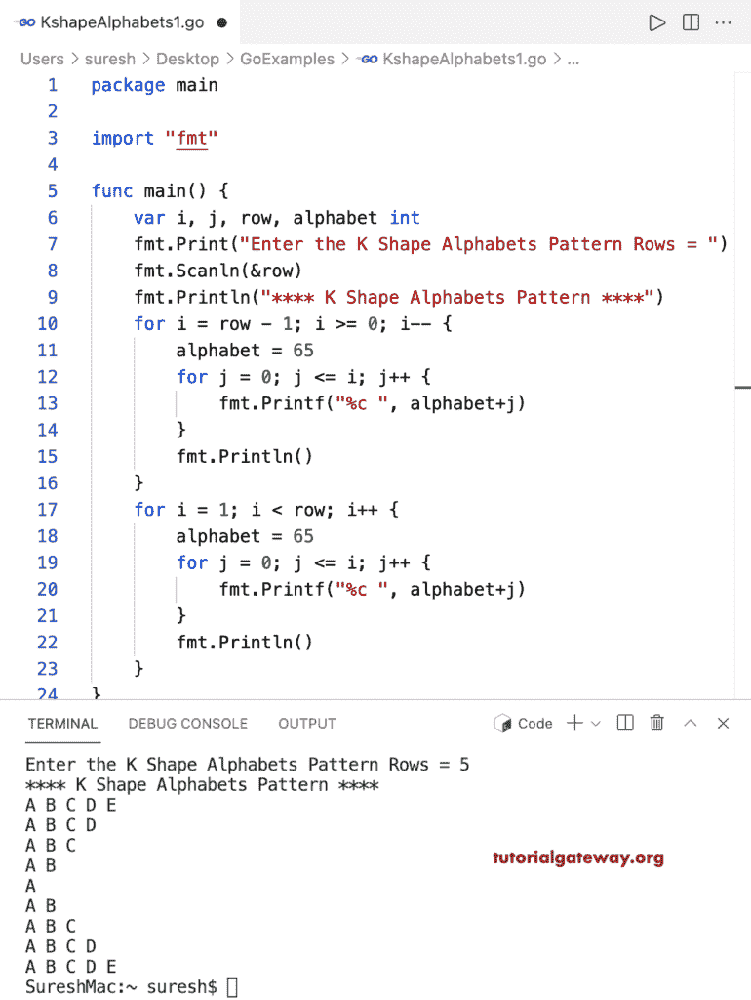

# Go 程序：打印字母的 K 形图案

> 原文：<https://www.tutorialgateway.org/go-program-to-print-k-shape-alphabets-pattern/>

写一个 Go 程序打印字母的用于循环的 K 形图案。

```go
package main

import "fmt"

func main() {

	var i, j, row, alphabet int

	fmt.Print("Enter the K Shape Alphabets Pattern Rows = ")
	fmt.Scanln(&row)

	fmt.Println("**** K Shape Alphabets Pattern ****")
	for i = row - 1; i >= 0; i-- {
		alphabet = 65
		for j = 0; j <= i; j++ {
			fmt.Printf("%c ", alphabet+j)
		}
		fmt.Println()
	}
	for i = 1; i < row; i++ {
		alphabet = 65
		for j = 0; j <= i; j++ {
			fmt.Printf("%c ", alphabet+j)
		}
		fmt.Println()
	}
}
```

