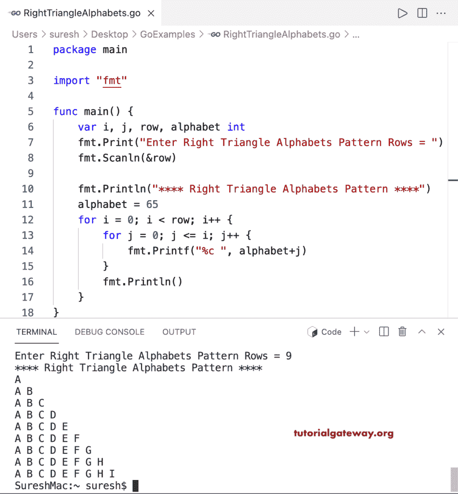

# Go 程序：打印字母的直角三角形图案

> 原文：<https://www.tutorialgateway.org/go-program-to-print-right-triangle-alphabets-pattern/>

写一个 Go 程序打印字母的直角三角形图案用于循环。

```go
package main

import "fmt"

func main() {

	var i, j, row, alphabet int

	fmt.Print("Enter Right Triangle Alphabets Pattern Rows = ")
	fmt.Scanln(&row)

	fmt.Println("**** Right Triangle Alphabets Pattern ****")

	alphabet = 65

	for i = 0; i < row; i++ {
		for j = 0; j <= i; j++ {
			fmt.Printf("%c ", alphabet+j)
		}
		fmt.Println()
	}
}
```

