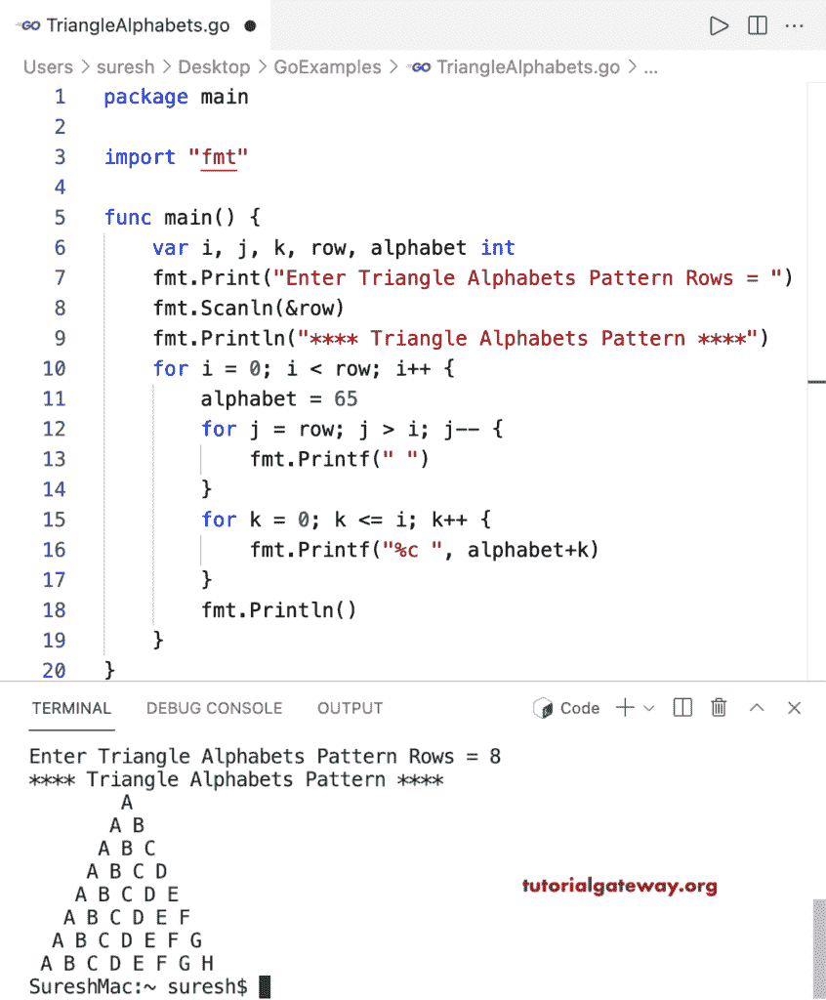

# Go 程序：打印三角形字母图案

> 原文：<https://www.tutorialgateway.org/go-program-to-print-triangle-alphabets-pattern/>

写一个 Go 程序打印三角形字母图案用于循环。

```go
package main

import "fmt"

func main() {

	var i, j, k, row, alphabet int

	fmt.Print("Enter Triangle Alphabets Pattern Rows = ")
	fmt.Scanln(&row)

	fmt.Println("**** Triangle Alphabets Pattern ****")

	for i = 0; i < row; i++ {
		alphabet = 65
		for j = row; j > i; j-- {
			fmt.Printf(" ")
		}
		for k = 0; k <= i; k++ {
			fmt.Printf("%c ", alphabet+k)
		}
		fmt.Println()
	}
}
```

