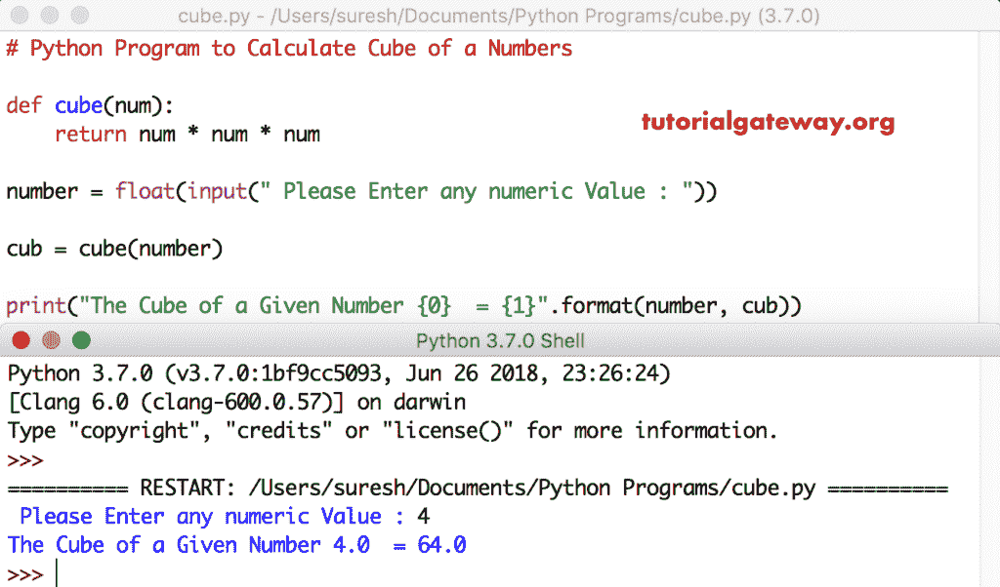

# Python 程序：计算数字立方

> 原文：<https://www.tutorialgateway.org/python-program-to-calculate-cube-of-a-number/>

写一个 Python 程序，用算术运算符和函数计算一个数的立方，并举例说明。

## 寻找数字立方体的 Python 程序

这个 Python 程序允许用户输入任何数值。接下来，Python 使用[算术运算符](https://www.tutorialgateway.org/python-arithmetic-operators/)找到该数字的立方体。

```py
# Python Program to Calculate Cube of a Number

number = float(input(" Please Enter any numeric Value : "))

cube = number * number * number

print("The Cube of a Given Number {0}  = {1}".format(number, cube))
```

一个数字输出的 Python 立方体

```py
 Please Enter any numeric Value : 5
The Cube of a Given Number 5.0  = 125.0
```

## 计算数字立方的 Python 程序示例 2

这个 [Python](https://www.tutorialgateway.org/python-tutorial/) 立方数的例子同上，但是在这里，我们使用的是[指数算子](https://www.tutorialgateway.org/python-arithmetic-operators/)。

```py
# Python Program to Calculate Cube of a Number

number = float(input(" Please Enter any numeric Value : "))

cube = number ** 3

print("The Cube of a Given Number {0}  = {1}".format(number, cube))
```

```py
 Please Enter any numeric Value : 10
The Cube of a Given Number 10.0  = 1000.0
```

## 用函数求数字立方体的 Python 程序

在这个 [Python 程序](https://www.tutorialgateway.org/python-programming-examples/)的立方体编号代码片段中，我们定义了一个[函数](https://www.tutorialgateway.org/functions-in-python/)，它可以找到给定数字的立方体。

```py
# Python Program to Calculate Cube of a Number

def cube(num):
    return num * num * num

number = float(input(" Please Enter any numeric Value : "))

cub = cube(number)

print("The Cube of a Given Number {0}  = {1}".format(number, cub))
```

