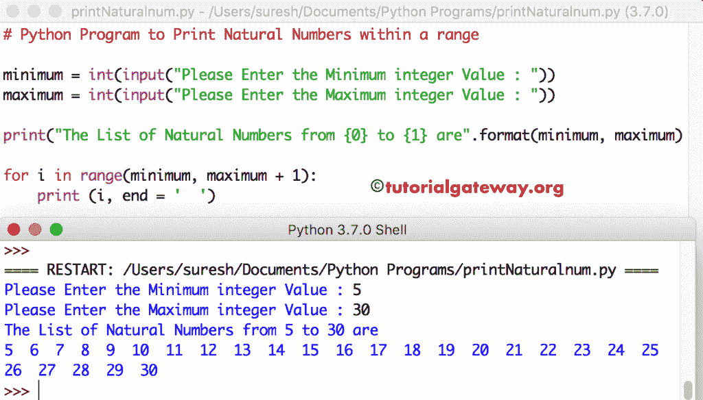

# Python 程序：打印自然数

> 原文：<https://www.tutorialgateway.org/python-program-to-print-natural-numbers/>

用例子写一个 Python 程序，用 While 循环和 For 循环打印自然数。

## 使用 For 循环打印自然数的 Python 程序

这个用于自然数的 Python 程序允许用户输入任何整数值。接下来，该程序使用 For 循环打印从 1 到用户指定值的自然数。

```py
# Python Program to Print Natural Numbers from 1 to N

number = int(input("Please Enter any Number: "))

print("The List of Natural Numbers from 1 to {0} are".format(number)) 

for i in range(1, number + 1):
    print (i, end = '  ')
```

Python 自然数输出

```py
Please Enter any Number: 10
The List of Natural Numbers from 1 to 10 are
1  2  3  4  5  6  7  8  9  10 
```

## 使用 While 循环的 Python 自然数程序

在这个显示自然数的 [Python](https://www.tutorialgateway.org/python-tutorial/) 程序中，我们只是将 [For Loop](https://www.tutorialgateway.org/python-for-loop/) 替换为 [While Loop](https://www.tutorialgateway.org/python-while-loop/)

```py
# Python Program to Print Natural Numbers from 1 to N

number = int(input("Please Enter any Number: "))
i = 1

print("The List of Natural Numbers from 1 to {0} are".format(number)) 

while ( i <= number):
    print (i, end = '  ')
    i = i + 1
```

Python 自然数使用 while 循环输出

```py
Please Enter any Number: 25
The List of Natural Numbers from 1 to 25 are
1  2  3  4  5  6  7  8  9  10  11  12  13  14  15  16  17  18  19  20  21  22  23  24  25 
```

## 显示一定范围内自然数的 Python 程序

这个用于自然数的 Python 程序与第一个示例相同。但是这次，我们允许用户输入最小值和最大值。这意味着这个程序打印从最小到最大的自然数。

```py
# Python Program to Print Natural Numbers within a range

minimum = int(input("Please Enter the Minimum integer Value : "))
maximum = int(input("Please Enter the Maximum integer Value : "))

print("The List of Natural Numbers from {0} to {1} are".format(minimum, maximum)) 

for i in range(minimum, maximum + 1):
    print (i, end = '  ')
```

