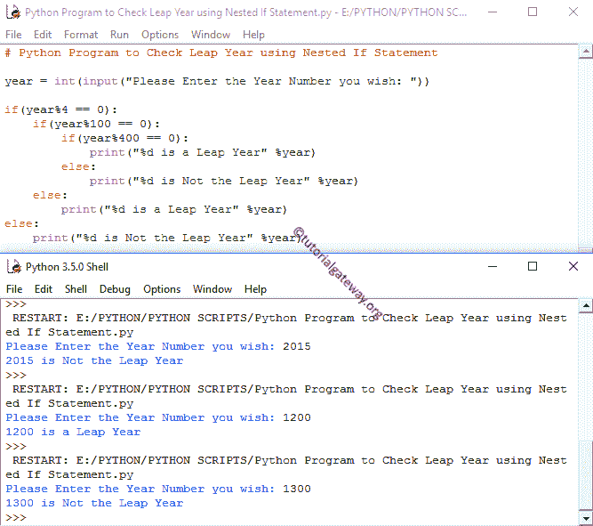

# Python 程序：检查闰年

> 原文：<https://www.tutorialgateway.org/python-program-to-check-leap-year/>

编写一个 Python 程序，通过使用 If 语句、嵌套 If 语句和 Elif 语句来检查闰年与否。在我们进入 Python 闰年程序之前，让我们看看 Python 闰年背后的逻辑和定义。

## Python 闰年计划

正常年份包含 365 天，但闰年包含 366 天。从逻辑上讲，除了百年之外，所有能被 4 整除的年份都叫做闰年。

世纪年意味着它们以 00 结尾，如 1200、1300、2400、2500 等。(显然它们可以被 100 整除)。对于这百年来说，我们还要进一步计算，才能查到 Python 中的闰年。

*   如果世纪年可以被 400 整除，那么那一年就是 Python 中的闰年。
*   如果不能被 400 整除，那么那一年就不是 Python 闰年。

## 使用 If 语句检查闰年的 Python 程序

这个针对闰年的 python 程序允许用户输入任何一年，并使用 If 语句检查用户输入的年份是否是闰年。

```py
# Check Leap Year using If Statement

year = int(input("Please Enter the Year Number you wish: "))

if (( year%400 == 0)or (( year%4 == 0 ) and ( year%100 != 0))):
    print("%d is a Leap Year" %year)
else:
    print("%d is Not the Leap Year" %year)
```

让我们检查闰年和正常年份(不是闰年)

```py
Please Enter the Year Number you wish: 1200
1200 is a Leap Year
>>> 
Please Enter the Year Number you wish: 1300
1300 is Not the Leap Year
```

在这个 Python 闰年程序中，由于我们必须在一个 If 语句中检查多个条件，所以我们使用了逻辑 AND 和逻辑 OR 运算符。让我们划分条件，以便更好地理解它

1:(年份%400 == 0)或

2:(年份%4 == 0)和

3:(年份%100 == 0))

在这个 [python 程序](https://www.tutorialgateway.org/python-programming-examples/)中，第一个条件(年份%400 == 0)将检查(年份%400)提醒是否正好等于 0。根据算法，任何能被 400 整除的数字在 Python 中都是闰年。

运筹学

第二个[如果 statemen](https://www.tutorialgateway.org/python-if-statement/) 用逻辑 AND 运算符保存 2 个语句，那么它们都必须为真。

第一个条件(年份%4 == 0)将检查(年份%4)的提醒是否正好等于 0。如果条件为假，则它将退出该条件，因为检查其他条件没有意义。绝对不是闰年。和

第二个条件将检查(年份% 100)提醒是否不等于 0。如果它是真的，那么给定的数字不是世纪数。

根据算法，任何能被 4 整除但不能被 100 整除的数都是 Python 闰年。

提示:请参考[逻辑运算符](https://www.tutorialgateway.org/python-logical-operators/)了解 [Python](https://www.tutorialgateway.org/python-tutorial/) 逻辑与和逻辑或的功能。

## 用 Elif 语句检查闰年的 Python 程序

这个闰年程序允许用户输入任何一年。然后用 [Python Elif 语句](https://www.tutorialgateway.org/python-elif-statement/)检查用户输入的年份是否为闰年。

```py
# Python Program to Check Leap Year using Elif Statement

year = int(input("Please Enter the Year Number you wish: "))

if (year%400 == 0):
          print("%d is a Leap Year" %year)
elif (year%100 == 0):
          print("%d is Not the Leap Year" %year)
elif (year%4 == 0):
          print("%d is a Leap Year" %year)
else:
          print("%d is Not the Leap Year" %year)
```

```py
Please Enter the Year Number you wish: 2022
2022 is Not the Leap Year
>>> 
=================== RESTART: /Users/suresh/Desktop/Python Leap Year.py ===================
Please Enter the Year Number you wish: 1300
1300 is Not the Leap Year
>>> 
=================== RESTART: /Users/suresh/Desktop/Python Leap Year.py ===================
Please Enter the Year Number you wish: 1200
1200 is a Leap Year
```

在这个检查闰年的 python 程序中，首先，用户将输入任何一年来检查该年是否是闰年。

*   第一个如果条件将检查(年份% 400)提醒是否正好等于 0。根据算法，任何能被 400 整除的数都是闰年。如果这个条件失败，那么它将进入下一个条件。
*   第二如果条件将检查(年% 100)提醒是否完全等于 0。根据算法，任何不能被 400 整除但能被 100 整除的数字都不是闰年(世纪年)。我们在第一个 If 语句中检查了(第 400 年)。因为它失败了，所以它变成了第二种情况。如果第一个和第二个条件都失败，那么它将转到第三个条件。
*   Python 闰年程序中的第三个条件会检查 year mod 4 是否等于 0。如果这个条件为真，那么给定的年份就是闰年，因为我们已经在前面的条件中检查了百年。如果所有语句都失败了，那么它将在最后变成 Else 语句。
*   如果以上所有陈述都失败了，那么这不是 Python 闰年

## 使用嵌套 If 语句检查闰年的 Python 程序

这个 Python 闰年程序允许用户输入任何一年。然后使用[嵌套 If](https://www.tutorialgateway.org/python-nested-if/) 语句检查用户输入的年份是否为闰年。

```py
# Check Leap Year using Nested If Statement

year = int(input("Please Enter the Year Number you wish: "))

if(year%4 == 0):
    if(year%100 == 0):
        if(year%400 == 0):
            print("%d is a Leap Year" %year)
        else:
            print("%d is Not the Leap Year" %year)
    else:
        print("%d is a Leap Year" %year)
else:
    print("%d is Not the Leap Year" %year)
```



这个 python 闰年程序允许用户输入任何一年来检查该年是否是闰年。第一个如果条件将检查(第%4 年)的提醒是否正好等于 0。

*   如果条件为假，给定的数字肯定不是闰年。
*   如果条件为真，那么我们要进一步检查百年。所以编译器将进入嵌套的 If 条件。

第二，如果 Python 闰年程序中的条件将检查(年份%100)提醒是否完全等于 0。

*   如果该条件为假，则年份不是世纪年。所以给定的数字肯定是闰年。
*   如果条件为真，那么我们必须检查这个数是否能被 400 整除。所以编译器会转到另一个嵌套的 If 条件。

此条件检查(年份%400)的剩余部分是否完全等于 0。

*   如果条件为假，那么给定的数字肯定不是闰年。
*   如果条件为真，那么给定的数字是闰年。