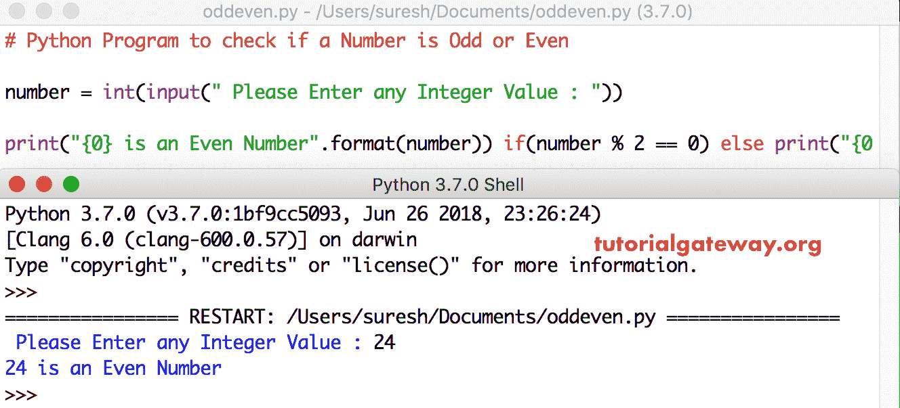

# Python 程序：检查数字是奇数还是偶数

> 原文：<https://www.tutorialgateway.org/python-program-to-check-if-a-number-is-odd-or-even/>

用 if 语句写一个 Python 程序来检查一个数字是奇数还是偶数，并举例说明。众所周知，如果数能被 2 整除，那么我们称之为偶数。剩下的(不能被 2 整除)称为奇数。

在 Python 中，我们有一个名为% module 的算术运算符来查看余数。让我们使用这个运算符，如果余数是 0，那么这个数是偶数，否则是奇数。

## 检查数字是奇数还是偶数的 Python 程序

这个寻找奇数或偶数的 Python 程序允许用户输入一个整数，并使用 If 语句检查该数字是偶数还是奇数。

```py
number = int(input(" Please Enter any Integer Value : "))

if(number % 2 == 0):
    print("{0} is an Even Number".format(number))
else:
    print("{0} is an Odd Number".format(number))
```

在这个 Python 奇数或偶数程序中，下面的语句要求用户输入任何整数值。

```py
number = int(input(" Please Enter any Integer Value : "))
```

在下一行，我们声明了 [If 语句](https://www.tutorialgateway.org/python-if-statement/ "If Statement in C")

能被 2 整除的数是偶数。 [Python](https://www.tutorialgateway.org/python-tutorial/) 中的[算术运算符](https://www.tutorialgateway.org/python-arithmetic-operators/)如果条件检查相同

*   如果条件为真，则为偶数
*   如果条件为假，则为奇数

输出

```py
 Please Enter any Integer Value : 9
9 is an Odd Number
```

让我输入第二个值来检查偶数。

```py
Please Enter any Integer Value : 28
28 is an Even Number
```

## 验证数字是奇数还是偶数的 Python 程序示例 2

在这个 Python 奇数或偶数程序示例中，我们在一行中使用 if 语句。

```py
number = int(input(" Please Enter any Integer Value : "))

print("{0} is an Even Number".format(number)) if(number % 2 == 0) else print("{0} is an Odd Number".format(number))
```



让我试试另一个价值

```py
 Please Enter any Integer Value : 19
19 is an Odd Number
```