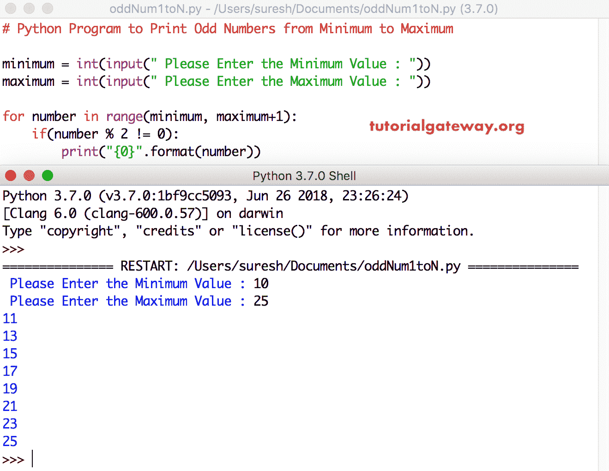

# Python 程序：打印从 1 到 N 的奇数

> 原文：<https://www.tutorialgateway.org/python-program-to-print-odd-numbers-from-1-to-n/>

写一个 Python 程序，使用 While 循环和 For 循环打印从 1 到 N 的奇数，并举例说明。

## 使用 For 循环打印从 1 到 N 的奇数的 Python 程序

这个 Python 程序允许用户输入最大限制值。接下来，Python 将打印奇数从 1 到用户输入的最大限制值。

在这个例子中，Python For Loop 确保奇数在 1 和最大极限值之间。

提示:建议大家参考 [Python 奇数或偶数程序](https://www.tutorialgateway.org/python-program-to-check-if-a-number-is-odd-or-even/)文章，了解 [Python](https://www.tutorialgateway.org/python-tutorial/) 奇数背后的逻辑。

```py
# Python Program to Print Odd Numbers from 1 to N

maximum = int(input(" Please Enter any Maximum Value : "))

for number in range(1, maximum + 1):
    if(number % 2 != 0):
        print("{0}".format(number))
```

Python 奇数用于循环和 if 语句输出

```py
 Please Enter any Maximum Value : 10
1
3
5
7
9
```

## 打印从 1 到 N 的奇数的 Python 程序

这个 [Python 程序](https://www.tutorialgateway.org/python-programming-examples/)对于从 1 到 N 的奇数的编码同上。但是，我们将[更改为循环](https://www.tutorialgateway.org/python-for-loop/)以消除 If 块。

如果你仔细观察，我们从 1 开始范围，我们使用的计数器值是 2。这意味着，对于第一次迭代次数= 1，第二次迭代次数= 3(不是 2)等等。

```py
# Python Program to Print Odd Numbers from 1 to N

maximum = int(input(" Please Enter any Maximum Value : "))

for number in range(1, maximum + 1, 2):
    print("{0}".format(number))
```

Python 奇数用于循环输出

```py
 Please Enter any Maximum Value : 12
1
3
5
7
9
11
```

## 使用 While 循环打印奇数的 Python 程序

在这个 python 奇数程序中，我们只是将 For 循环替换为 [While 循环](https://www.tutorialgateway.org/python-while-loop/)。

```py
# Python Program to Print Odd Numbers from 1 to N

maximum = int(input(" Please Enter the Maximum Value : "))

number = 1

while number <= maximum:
    if(number % 2 != 0):
        print("{0}".format(number))
    number = number + 1
```

```py
 Please Enter the Maximum Value : 15
1
3
5
7
9
11
13
15
```

## 使用 For 循环显示从 1 到 100 的奇数的 Python 程序

这个 python 显示奇数的程序允许用户输入最小值和最大值。接下来，Python 显示最小值和最大值之间的奇数。

```py
# Python Program to Print Odd Numbers from Minimum to Maximum

minimum = int(input(" Please Enter the Minimum Value : "))
maximum = int(input(" Please Enter the Maximum Value : "))

for number in range(minimum, maximum+1):
    if(number % 2 != 0):
        print("{0}".format(number))
```

