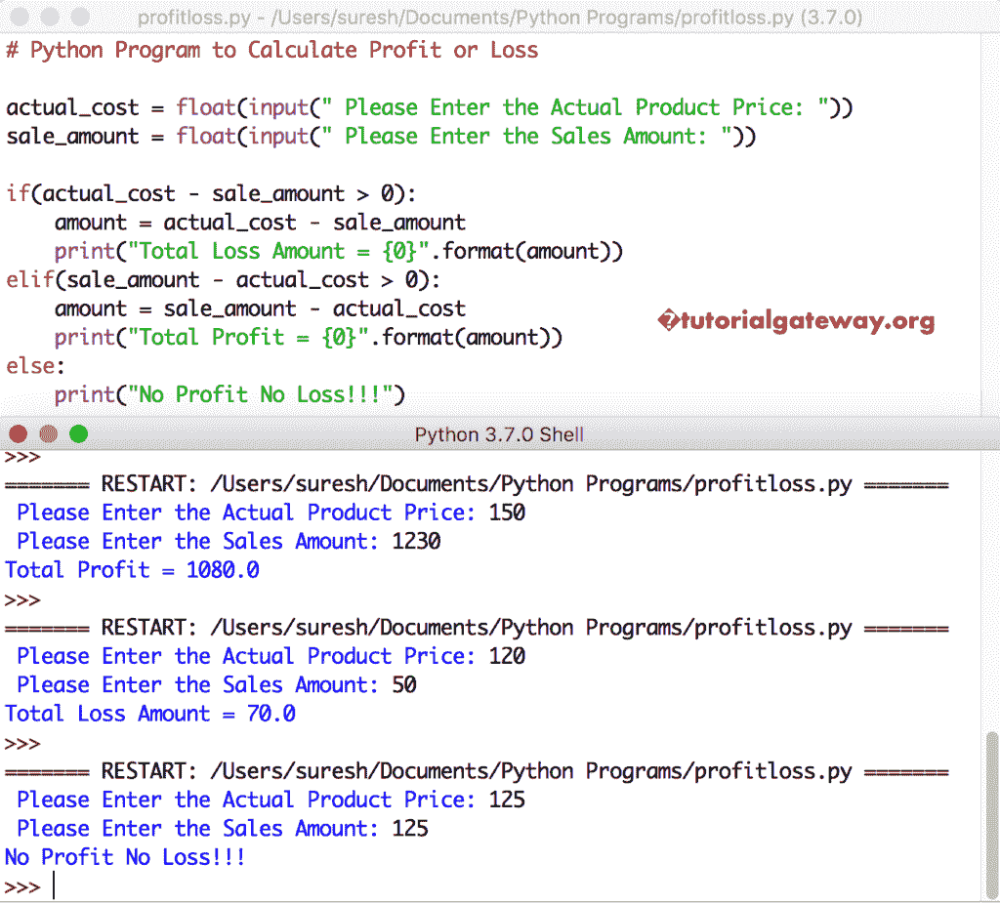

# Python 程序：计算损益

> 原文：<https://www.tutorialgateway.org/python-program-to-calculate-profit-or-loss/>

写一个 Python 程序，用实例计算盈亏。

## 使用 Elif 语句计算损益的 Python 程序

这个 python 程序允许用户输入产品的销售额和实际成本。接下来，Python 使用 Elif 语句基于这两个值计算损失金额或利润金额。

```py
# Python Program to Calculate Profit or Loss

actual_cost = float(input(" Please Enter the Actual Product Price: "))
sale_amount = float(input(" Please Enter the Sales Amount: "))

if(actual_cost > sale_amount):
    amount = actual_cost - sale_amount
    print("Total Loss Amount = {0}".format(amount))
elif(sale_amount > actual_cost):
    amount = sale_amount - actual_cost
    print("Total Profit = {0}".format(amount))
else:
    print("No Profit No Loss!!!")
```

Python 损益输出

```py
 Please Enter the Actual Product Price: 1500
 Please Enter the Sales Amount: 1200
Total Loss Amount = 300.0
```

让我试试不同的价值观



[Elif 声明](https://www.tutorialgateway.org/python-elif-statement/)为

```py
if(actual_cost > sale_amount):
    amount = actual_cost - sale_amount
    print("Total Loss Amount = {0}".format(amount))
elif(sale_amount > actual_cost):
    amount = sale_amount - actual_cost
    print("Total Profit = {0}".format(amount))
else:
    print("No Profit No Loss!!!")
```

*   If 条件检查实际成本是否大于销售金额。如果为真，则 [Python](https://www.tutorialgateway.org/python-tutorial/) 将损失金额打印为实际成本-销售额
*   Elif 语句检查销售金额是否大于实际成本。如果为真，它会将利润额打印为销售额-实际成本
*   如果上述条件失败，则意味着无利无损。

## 用算术运算符计算盈亏的 Python 程序

在这个盈亏 [python 程序](https://www.tutorialgateway.org/python-programming-examples/)中，我们使用的是一个[减运算符](https://www.tutorialgateway.org/python-arithmetic-operators/)。

```py
# Python Program to Calculate Profit or Loss

actual_cost = float(input(" Please Enter the Actual Product Price: "))
sale_amount = float(input(" Please Enter the Sales Amount: "))

if(actual_cost - sale_amount > 0):
    amount = actual_cost - sale_amount
    print("Total Loss Amount = {0}".format(amount))
elif(sale_amount - actual_cost > 0):
    amount = sale_amount - actual_cost
    print("Total Profit = {0}".format(amount))
else:
    print("No Profit No Loss!!!")
```

在这里，我们尝试了所有的可能性，Python 盈亏程序的输出是

```py
 Please Enter the Actual Product Price: 2200
 Please Enter the Sales Amount: 6500
Total Profit = 4300.0
>>> 
 Please Enter the Actual Product Price: 9800
 Please Enter the Sales Amount: 7200
Total Loss Amount = 2600.0
>>> 
 Please Enter the Actual Product Price: 1495
 Please Enter the Sales Amount: 1495
No Profit No Loss!!!
```