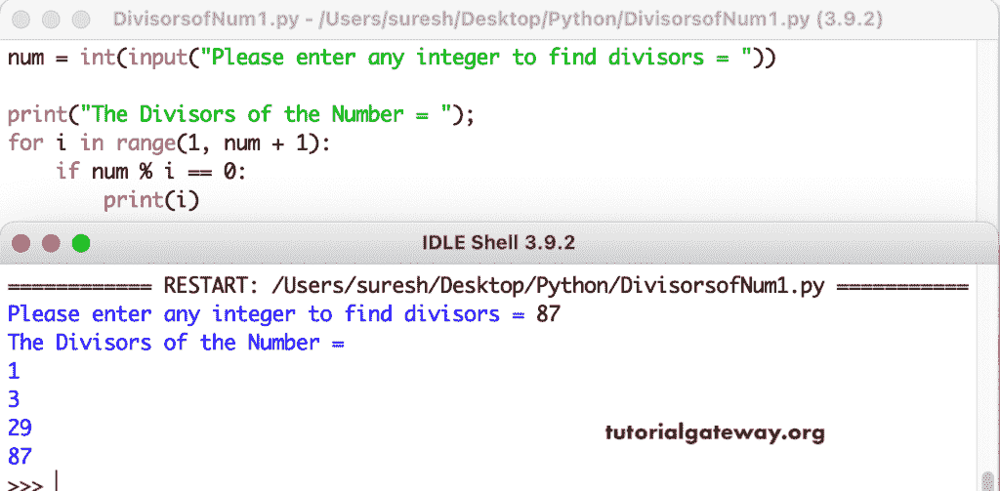

# Python 程序：寻找整数所有除数

> 原文：<https://www.tutorialgateway.org/python-program-to-find-all-divisors-of-an-integer/>

编写一个 Python 程序，使用 for 循环查找整数或数字的所有除数。在这个 Python 示例中，for 循环从 1 迭代到给定的数字，并检查每个数字是否可以被数字完全整除。如果为真，则将该数作为除数打印出来。

```py
num = int(input("Please enter any integer to find divisors = "))

print("The Divisors of the Number = ")

for i in range(1, num + 1):
    if num % i == 0:
        print(i)
```



Python 程序使用 while 循环查找整数的所有除数。

```py
num = int(input("Please enter any integer to find divisors = "))

print("The Divisors of the Number = ")

i = 1

while(i <= num):
    if num % i == 0:
        print(i)
    i = i + 1
```

```py
Please enter any integer to find divisors = 100
The Divisors of the Number = 
1
2
4
5
10
20
25
50
100
```

在这个 [Python 示例](https://www.tutorialgateway.org/python-programming-examples/)中，我们创建了一个 find 除数函数，它将查找并返回给定数字的所有除数。

```py
def findDivisors(num):
    for i in range(1, num + 1):
        if num % i == 0:
            print(i)
# End of Function

num = int(input("Please enter any integer to find divisors = "))

print("The Divisors of the Number = ")
findDivisors(num)
```

```py
Please enter any integer to find divisors = 500
The Divisors of the Number = 
1
2
4
5
10
20
25
50
100
125
250
500
```