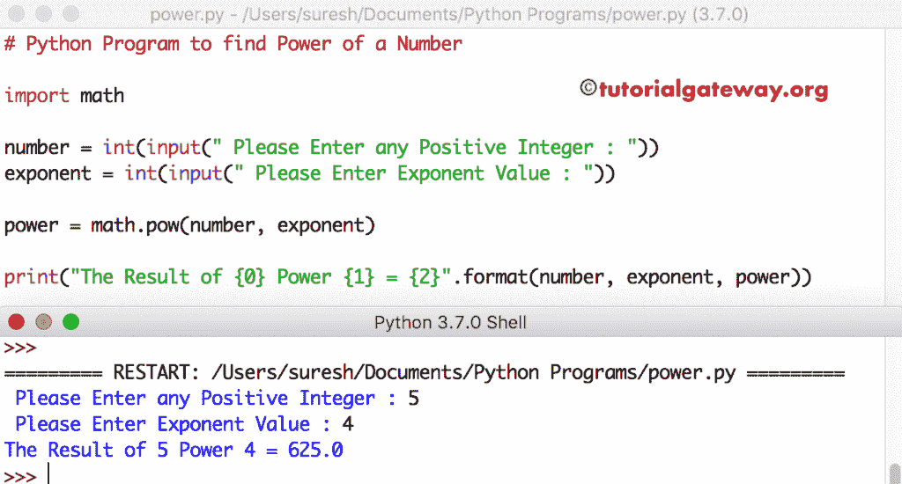

# Python 程序：寻找数的幂

> 原文：<https://www.tutorialgateway.org/python-program-to-find-power-of-a-number/>

写一个 Python 程序，用一个例子求出循环数、While 循环数和幂函数的幂。

## 用 For 循环求一个数的幂的程序

这个 Python 程序允许用户输入任何数值，指数。接下来，这个 [Python](https://www.tutorialgateway.org/python-tutorial/) 程序使用[求循环](https://www.tutorialgateway.org/python-for-loop/)来求一个数的幂。

```py
# Python Program to find Power of a Number

number = int(input(" Please Enter any Positive Integer : "))
exponent = int(input(" Please Enter Exponent Value : "))
power = 1

for i in range(1, exponent + 1):
    power = power * number

print("The Result of {0} Power {1} = {2}".format(number, exponent, power))
```

Python 数字幂用于循环输出

```py
 Please Enter any Positive Integer : 3
 Please Enter Exponent Value : 4
The Result of 3 Power 4 = 81
```

## Python 程序使用 While 循环返回一个数的幂

这个数字程序的幂和上面一样，但是这次我们用的是 [While Loop](https://www.tutorialgateway.org/python-while-loop/)

```py
# Python Program to find Power of a Number

number = int(input(" Please Enter any Positive Integer : "))
exponent = int(input(" Please Enter Exponent Value : "))

power = 1
i = 1

while(i <= exponent):
    power = power * number
    i = i + 1

print("The Result of {0} Power {1} = {2}".format(number, exponent, power))
```

使用 while 循环输出 时的 Python 幂

```py
 Please Enter any Positive Integer : 10
 Please Enter Exponent Value : 5
The Result of 10 Power 5 = 100000
```

## 用幂函数求一个数的幂的程序

这个 [Python 程序](https://www.tutorialgateway.org/python-programming-examples/)示例接受来自用户的数字和指数。接下来，我们使用内置的[数学函数](https://www.tutorialgateway.org/python-math-functions/)调用[幂](https://www.tutorialgateway.org/python-pow/)来求一个数的幂。

```py
# Python Program to find Power of a Number

import math

number = int(input(" Please Enter any Positive Integer : "))
exponent = int(input(" Please Enter Exponent Value : "))

power = math.pow(number, exponent)

print("The Result of {0} Power {1} = {2}".format(number, exponent, power))

```

