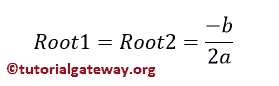

# Python 程序：寻找二次方程根

> 原文：<https://www.tutorialgateway.org/python-program-to-find-roots-of-a-quadratic-equation/>

写一个 Python 程序，用一个例子找到一个二次方程的根。二次方程的数学表示是 ax +bx+c = 0。一个二次方程可以有两个根，它们完全取决于判别式。如果判别式> 0，则该方程存在两个不同的实根


如果判别式= 0，则存在两个相等的实根。



而如果判别< 0, Two Distinct Complex Roots exists.


## 用 elif 求二次方程根的 Python 程序

这个 [python 程序](https://www.tutorialgateway.org/python-programming-examples/)允许用户输入 a、b 和 c 的三个值。通过使用这些值，这个 [Python](https://www.tutorialgateway.org/python-tutorial/) 代码使用 [Elif 语句](https://www.tutorialgateway.org/python-elif-statement/)找到一个二次方程的根。

```py
# Python Program to find roots of a Quadratic Equation
import math

a = int(input("Please Enter a Value of a Quadratic Equation : "))
b = int(input("Please Enter b Value of a Quadratic Equation : "))
c = int(input("Please Enter c Value of a Quadratic Equation : "))

discriminant = (b * b) - (4 * a * c)

if(discriminant > 0):
    root1 = (-b + math.sqrt(discriminant) / (2 * a))
    root2 = (-b - math.sqrt(discriminant) / (2 * a))
    print("Two Distinct Real Roots Exists: root1 = %.2f and root2 = %.2f" %(root1, root2))
elif(discriminant == 0):
    root1 = root2 = -b / (2 * a)
    print("Two Equal and Real Roots Exists: root1 = %.2f and root2 = %.2f" %(root1, root2))
elif(discriminant < 0):
    root1 = root2 = -b / (2 * a)
    imaginary = math.sqrt(-discriminant) / (2 * a)
    print("Two Distinct Complex Roots Exists: root1 = %.2f+%.2f and root2 = %.2f-%.2f" %(root1, imaginary, root2, imaginary))
```

