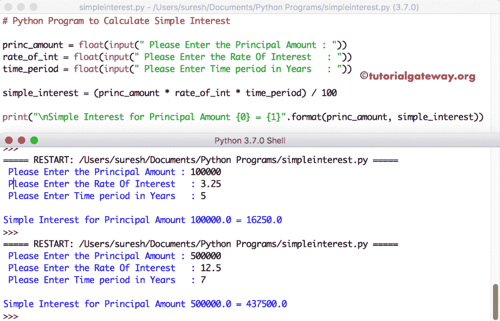

# Python 程序：计算单利

> 原文：<https://www.tutorialgateway.org/python-program-to-calculate-simple-interest/>

用例子写一个计算简单利息的 Python 程序。在我们进入示例之前，让我向您展示简单利息计算背后的公式:

单利=(本金*利率*年数)/ 100

## 计算单利的 Python 程序

这个 [Python](https://www.tutorialgateway.org/python-tutorial/) 程序允许用户输入本金金额、投资回报率和年数。通过使用这些值，[程序](https://www.tutorialgateway.org/python-programming-examples/)使用上述公式计算简单利息。

```py
princ_amount = float(input(" Please Enter the Principal Amount : "))
rate_of_int = float(input(" Please Enter the Rate Of Interest   : "))
time_period = float(input(" Please Enter Time period in Years   : "))

simple_interest = (princ_amount * rate_of_int * time_period) / 100

print("\nSimple Interest for Principal Amount {0} = {1}".format(princ_amount, simple_interest))
```

