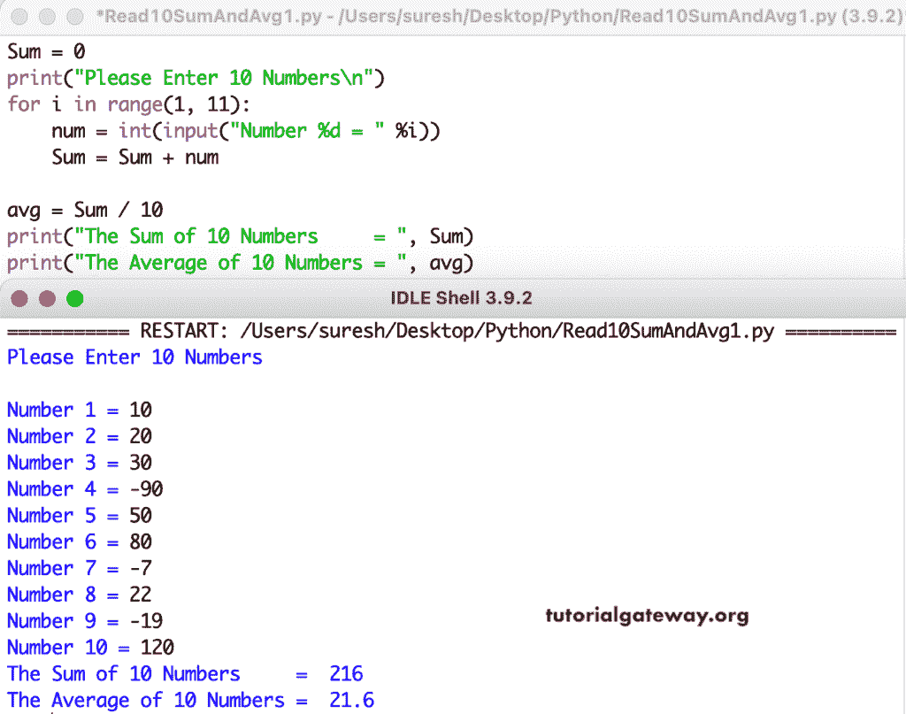

# Python 程序：读取 10 个数字并找出它们的总和和平均值

> 原文：<https://www.tutorialgateway.org/python-program-to-read-10-numbers-and-find-their-sum-and-average/>

写一个 Python 程序来读取 10 个数字，并找出它们的总和和平均值。在这个 Python 示例中，for 循环范围从 1 到 10 迭代，读取用户输入的 10 个数字，并在输入时找到总和。接下来，我们将总和除以 10 得到平均值。

```py
Sum = 0

print("Please Enter 10 Numbers\n")
for i in range(1, 11):
    num = int(input("Number %d = " %i))
    Sum = Sum + num

avg = Sum / 10

print("The Sum of 10 Numbers     = ", Sum)
print("The Average of 10 Numbers = ", avg)

```



这个 Python [程序](https://www.tutorialgateway.org/python-programming-examples/)从用户输入中读取 10 个数字，并使用 while 循环找到它们的总和和平均值。

```py
Sum = 0

print("Please Enter 10 Numbers\n")
i = 1
while(i <= 10):
    num = int(input("Number %d = " %i))
    Sum = Sum + num
    i = i + 1

avg = Sum / 10

print("The Sum of 10 Numbers     = ", Sum)
print("The Average of 10 Numbers = ", avg)

```

```py
Please Enter 10 Numbers

Number 1 = 34
Number 2 = 2
Number 3 = 65
Number 4 = 45
Number 5 = 76
Number 6 = -98
Number 7 = 33
Number 8 = 66
Number 9 = 88
Number 10 = 122
The Sum of 10 Numbers     =  433
The Average of 10 Numbers =  43.3
```