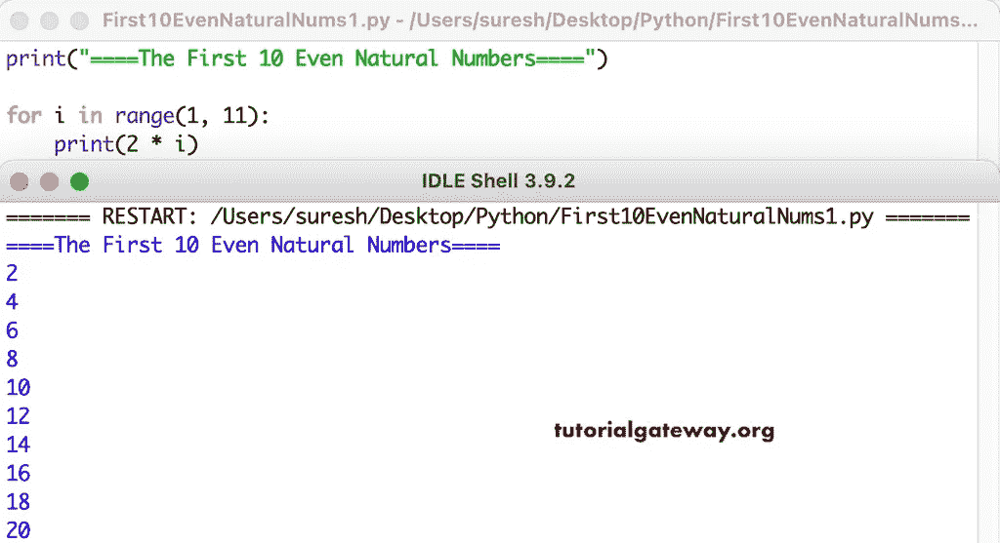

# Python 程序：打印前 10 个偶数

> 原文：<https://www.tutorialgateway.org/python-program-to-print-first-10-even-natural-numbers/>

编写一个 Python 程序，使用 for 循环打印前 10 个偶数自然数。

```py
print("====The First 10 Even Natural Numbers====")

for i in range(1, 11):
    print(2 * i)
```



这个 [Python 程序](https://www.tutorialgateway.org/python-programming-examples/)使用 while 循环显示前 10 个偶数自然数。

```py
print("====The First 10 Even Natural Numbers====")

i = 1
while(i <= 10):
    print(2 * i)
    i = i + 1
```

```py
====The First 10 Even Natural Numbers====
2
4
6
8
10
12
14
16
18
20
```