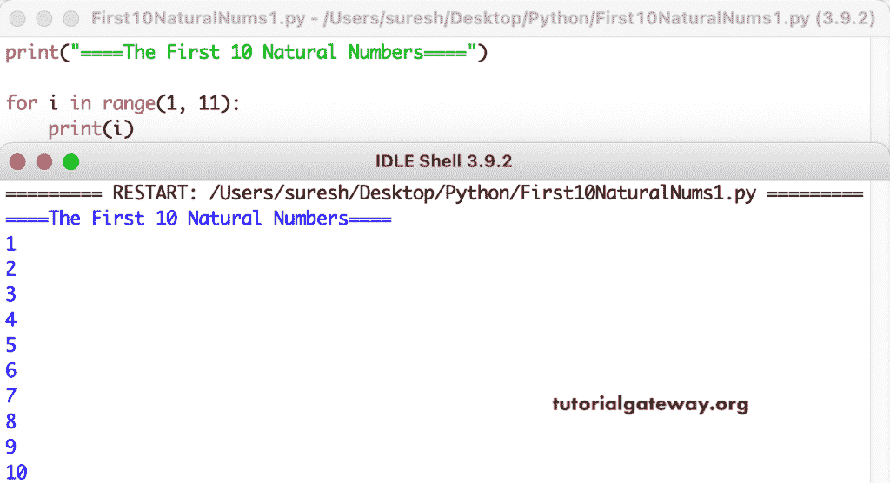

# Python 程序：打印前 10 个自然数

> 原文：<https://www.tutorialgateway.org/python-program-to-print-first-10-natural-numbers/>

编写一个 Python 程序，使用 for 循环打印前 10 个自然数。

```py
print("====The First 10 Natural Numbers====")

for i in range(1, 11):
    print(i)
```



这个 [Python 程序](https://www.tutorialgateway.org/python-programming-examples/)使用 while 循环显示前 10 个自然数。

```py
print("====The First 10 Natural Numbers====")
i = 1

while(i <= 10):
    print(i)
    i = i + 1
```

```py
====The First 10 Natural Numbers====
1
2
3
4
5
6
7
8
9
10
```