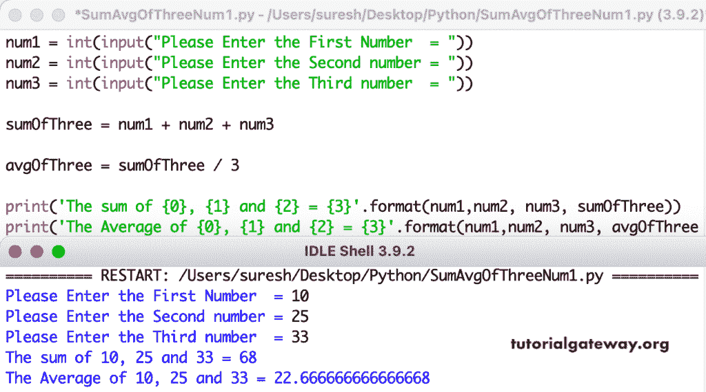

# Python 程序：求三个数的和与均值

> 原文：<https://www.tutorialgateway.org/python-program-to-find-the-sum-and-average-of-three-numbers/>

写一个 Python 程序，求三个数的和与均值。这个 Python 示例接受三个整数值，并使用算术运算符计算总和和平均值。

```py
num1 = int(input("Please Enter the First Number  = "))
num2 = int(input("Please Enter the Second number = "))
num3 = int(input("Please Enter the Third number  = "))

sumOfThree = num1 + num2 + num3

avgOfThree = sumOfThree / 3

print('The sum of {0}, {1} and {2} = {3}'.format(num1,num2, num3, sumOfThree))
print('The Average of {0}, {1} and {2} = {3}'.format(num1,num2, num3, avgOfThree))
```



Python 程序求三个浮点数的和与均值。

```py
num1 = float(input("Please Enter the First Number  = "))
num2 = float(input("Please Enter the Second number = "))
num3 = float(input("Please Enter the Third number  = "))

sumOfThree = num1 + num2 + num3

avg = sumOfThree / 3

flooravg = sumOfThree // 3

print('The sum of {0}, {1} and {2} = {3}'.format(num1,num2, num3, sumOfThree))
print('The Average of {0}, {1} and {2} = {3}'.format(num1,num2, num3, avg))
print('Floor Average of {0}, {1} and {2} = {3}'.format(num1,num2, num3, flooravg))
```

```py
Please Enter the First Number  = 19.6
Please Enter the Second number = 12.8
Please Enter the Third number  = 156.98
The sum of 19.6, 12.8 and 156.98 = 189.38
The Average of 19.6, 12.8 and 156.98 = 63.126666666666665
Floor Average of 19.6, 12.8 and 156.98 = 63.0
```