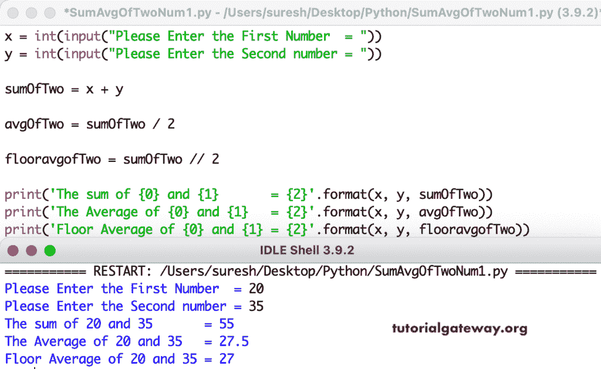

# Python 程序：计算两个数平均值

> 原文：<https://www.tutorialgateway.org/python-program-to-find-the-average-of-two-numbers/>

写一个 Python 程序，求两个数的平均值。这个 Python 示例接受两个整数，并计算总和和平均值。

```py
x = int(input("Please Enter the First Number  = "))
y = int(input("Please Enter the Second number = "))

sumOfTwo = x + y

avgOfTwo = sumOfTwo / 2

flooravgofTwo = sumOfTwo // 2

print('The sum of {0} and {1}       = {2}'.format(x, y, sumOfTwo))
print('The Average of {0} and {1}   = {2}'.format(x, y, avgOfTwo))
print('Floor Average of {0} and {1} = {2}'.format(x, y, flooravgofTwo))
```



Python 程序求两个浮点数的平均值。

```py
x = float(input("Please Enter the First Number  = "))
y = float(input("Please Enter the Second number = "))

sumOfTwo = x + y

avgOfTwo = sumOfTwo / 2

flooravgofTwo = sumOfTwo // 2

print('The sum of {0} and {1}       = {2}'.format(x, y, sumOfTwo))
print('The Average of {0} and {1}   = {2}'.format(x, y, avgOfTwo))
print('Floor Average of {0} and {1} = {2}'.format(x, y, flooravgofTwo))
```

```py
Please Enter the First Number  = 22.9
Please Enter the Second number = 14.7
The sum of 22.9 and 14.7       = 37.599999999999994
The Average of 22.9 and 14.7   = 18.799999999999997
Floor Average of 22.9 and 14.7 = 18.0
```