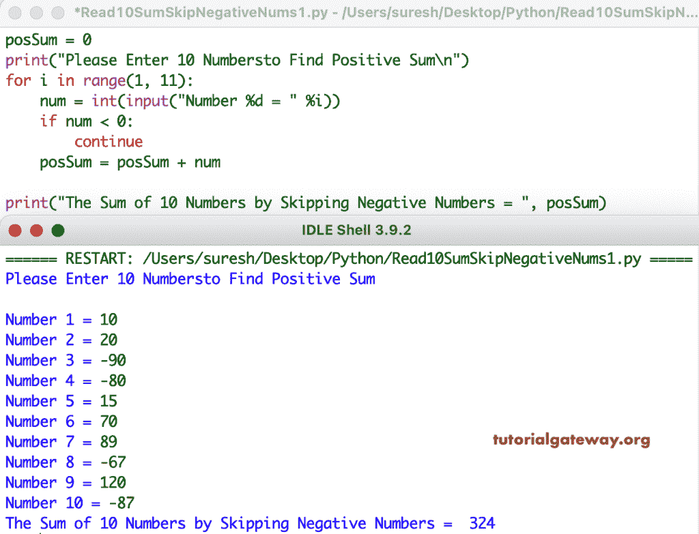

# Python 程序：计算 10 个数的和并跳过负数

> 原文：<https://www.tutorialgateway.org/python-program-to-find-sum-of-10-numbers-and-skip-negative-numbers/>

写一个 Python 程序，求 10 个数的和，跳过负数。在这个 Python 示例中，for 循环范围允许输入 10 个数字，if 条件检查是否有负数。如果为真，continue 语句将跳过该数字，不将其添加到 posSum 变量中。

```py
posSum = 0

print("Please Enter 10 Numbersto Find Positive Sum\n")
for i in range(1, 11):
    num = int(input("Number %d = " %i))

    if num < 0:
        continue

    posSum = posSum + num

print("The Sum of 10 Numbers by Skipping Negative Numbers = ", posSum)
```



这个 Python [程序](https://www.tutorialgateway.org/python-programming-examples/)找到 10 个正数的和，并使用 while 循环跳过负数。

```py
posSum = 0

print("Please Enter 10 Numbersto Find Positive Sum\n")
i = 1
while(i <= 10):
    num = int(input("Number %d = " %i))

    if num < 0:
        i = i + 1
        continue

    posSum = posSum + num
    i = i + 1

print("The Sum of 10 Numbers by Skipping Negative Numbers = ", posSum)
```

```py
Please Enter 10 Numbersto Find Positive Sum

Number 1 = 10
Number 2 = -12
Number 3 = 15
Number 4 = -24
Number 5 = 100
Number 6 = -90
Number 7 = 120
Number 8 = -34
Number 9 = 80
Number 10 = 70
The Sum of 10 Numbers by Skipping Negative Numbers =  395
```