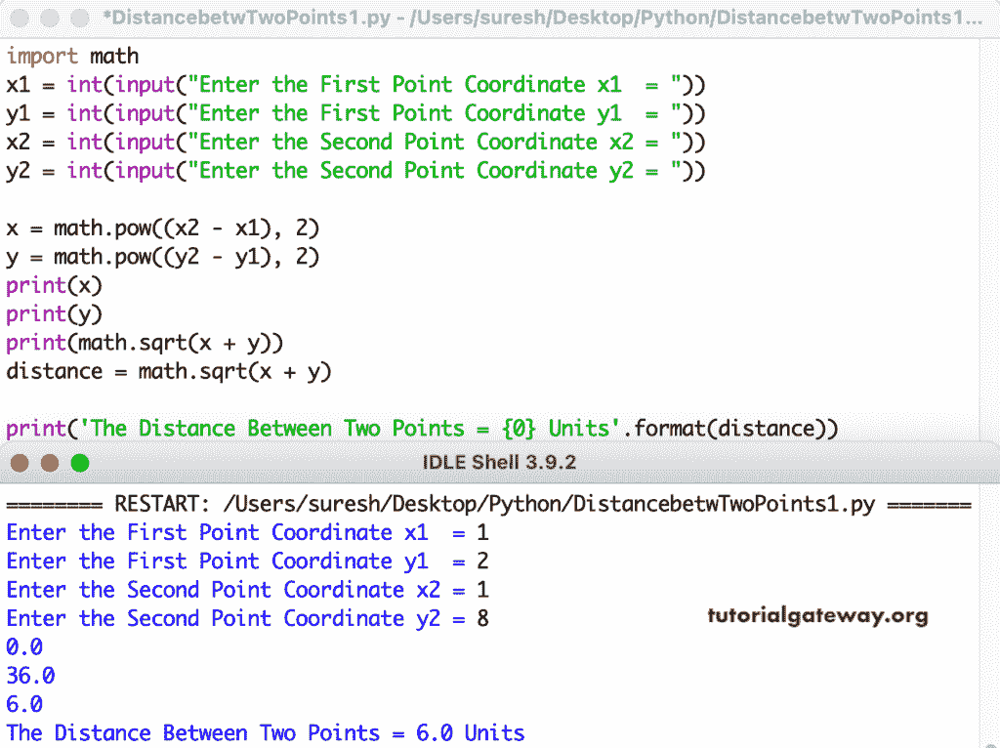

# Python 程序：寻找两点间距离

> 原文：<https://www.tutorialgateway.org/python-program-to-find-distance-between-two-points/>

写一个 Python 程序，求两点之间的距离。这个 python 示例接受第一个和第二个坐标点，并使用数学幂和 sqrt 函数计算距离。

```py
import math

x1 = int(input("Enter the First Point Coordinate x1  = "))
y1 = int(input("Enter the First Point Coordinate y1  = "))
x2 = int(input("Enter the Second Point Coordinate x2 = "))
y2 = int(input("Enter the Second Point Coordinate y2 = "))

x = math.pow((x2 - x1), 2)
y = math.pow((y2 - y1), 2)

print(x)
print(y)
print(math.sqrt(x + y))
distance = math.sqrt(x + y)

print('The Distance Between Two Points = {0} Units'.format(distance))
```



Python 程序使用函数寻找两点之间的距离。

[它](https://www.tutorialgateway.org/python-programming-examples/)接受两点并返回这两点之间的距离。

```py
import math

def distanceBetweenTwo(x1, y1, x2, y2):
    return math.sqrt((math.pow((x2 - x1), 2)) + (math.pow((y2 - y1), 2)))

x1 = int(input("Enter the First Point Coordinate x1  = "))
y1 = int(input("Enter the First Point Coordinate y1  = "))
x2 = int(input("Enter the Second Point Coordinate x2 = "))
y2 = int(input("Enter the Second Point Coordinate y2 = "))

distance = distanceBetweenTwo(x1, y1, x2, y2)

print('The Distance Between Two Points = {0} Units'.format(distance))
```

```py
Enter the First Point Coordinate x1  = 1
Enter the First Point Coordinate y1  = 11
Enter the Second Point Coordinate x2 = 3
Enter the Second Point Coordinate y2 = 25
The Distance Between Two Points = 14.142135623730951 Units
```