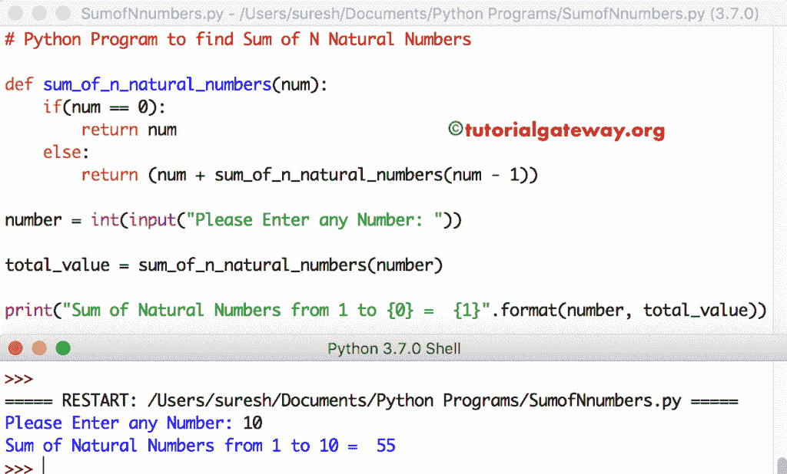

# Python 程序：寻找`N`个自然数之和

> 原文：<https://www.tutorialgateway.org/python-program-to-find-sum-of-n-natural-numbers/>

写一个 Python 程序，用 While 循环、For 循环和带有例子的函数来求`N`个自然数的和。

## 用 For 循环求`N`个自然数之和的 Python 程序

这个 Python 程序允许用户输入任何整数值。接下来，它使用 For 循环计算从 1 到用户指定值的自然数总和。

```py
number = int(input("Please Enter any Number: "))
total = 0

for value in range(1, number + 1):
    total = total + value

print("The Sum of Natural Numbers from 1 to {0} =  {1}".format(number, total))
```

```py
Please Enter any Number: 25
The Sum of Natural Numbers from 1 to 25 =  325
```

## 使用 While 循环计算`N`个自然数之和的 Python 程序

在这个 Python 自然数求和程序中，我们刚刚用[代替了](https://www.tutorialgateway.org/python-while-loop/) [For Loop](https://www.tutorialgateway.org/python-for-loop/) ，而 Loop

```py
num = int(input("Please Enter any Num: "))

total = 0
value = 1

while (value <= num):
    total = total + value
    value = value + 1

print("The Sum from 1 to {0} =  {1}".format(num, total))
```

```py
Please Enter any Num: 12
The Sum from 1 to 12 =  78
```

## 用函数计算`N`个自然数之和的 Python 程序

在这个 [Python 程序](https://www.tutorialgateway.org/python-programming-examples/)中，我们创建了一个新的函数来求自然数的和。在这个函数中，我们使用了 [If Else 语句](https://www.tutorialgateway.org/python-if-else/)。

```py
def sum_of_n_natural_numbers(num):
    if(num == 0):
        return num
    else:
        return (num * (num + 1) / 2)

number = int(input("Please Enter any Number: "))

total_value = sum_of_n_natural_numbers(number)

print("Sum from 1 to {0} =  {1}".format(number, total_value))
```

```py
Please Enter any Number: 100
Sum from 1 to 100 =  5050.0
```

## 用函数计算`N`个自然数之和的 Python 程序

这个 Python 自然数求和程序与上面的例子相同，但是这次我们使用的是递归。

```py
def sum_of_n_natural_numbers(num):
    if(num == 0):
        return num
    else:
        return (num + sum_of_n_natural_numbers(num - 1))

number = int(input("Please Enter any Number: "))

total_value = sum_of_n_natural_numbers(number)

print("Sum of Natural Numbers from 1 to {0} =  {1}".format(number, total_value))
```

