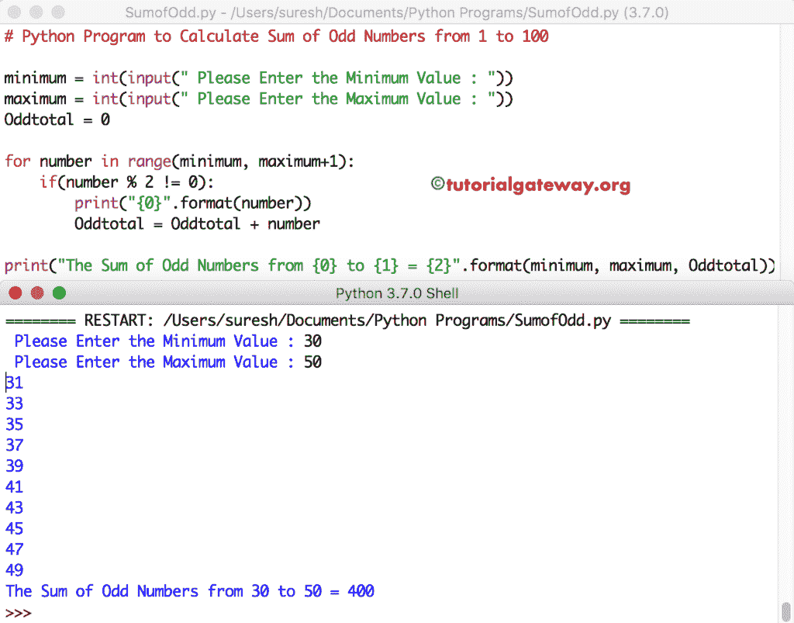

# Python 程序：计算奇数和

> 原文：<https://www.tutorialgateway.org/python-program-to-calculate-sum-of-odd-numbers/>

编写一个 Python 程序，使用 While 循环和 For 循环计算从 1 到 N 的奇数之和，并给出一个例子。

## 用 For 循环计算从 1 到 N 的奇数和的 Python 程序

这个 Python 程序允许用户输入最大值。接下来，Python 将计算从 1 到用户输入的最大值的奇数之和。

在本例中，For 循环用于保持奇数在 1 和最大值之间。

提示:建议大家参考 [Python 奇数从 1 到 N](https://www.tutorialgateway.org/python-program-to-print-odd-numbers-from-1-to-n/) 的文章，了解 [Python](https://www.tutorialgateway.org/python-tutorial/) 打印奇数背后的逻辑。

```py
# Python Program to Calculate Sum of Odd Numbers from 1 to N

maximum = int(input(" Please Enter the Maximum Value : "))
Oddtotal = 0

for number in range(1, maximum+1):
    if(number % 2 != 0):
        print("{0}".format(number))
        Oddtotal = Oddtotal + number

print("The Sum of Odd Numbers from 1 to {0} = {1}".format(number, Oddtotal)) 
```

Python 奇数和输出

```py
 Please Enter the Maximum Value : 12
1
3
5
7
9
11
The Sum of Odd Numbers from 1 to 12 = 36
```

## Python 程序显示从 1 到 N 的奇数之和，不带 If

这个 Python 奇数和程序同上。但是，我们在 for 循环中使用了第三个参数来消除 If 块。

```py
# Python Program to Calculate Sum of Odd Numbers from 1 to N

maximum = int(input(" Please Enter the Maximum Value : "))
Oddtotal = 0

for number in range(1, maximum+1, 2):
    print("{0}".format(number))
    Oddtotal = Oddtotal + number

print("The Sum of Odd Numbers from 1 to {0} = {1}".format(number, Oddtotal))
```

Python 奇数和使用 for 循环输出

```py
 Please Enter the Maximum Value : 15
1
3
5
7
9
11
13
15
The Sum of Odd Numbers from 1 to 15 = 64
```

## 使用 While 循环寻找奇数和的 Python 程序

在本 Python [程序](https://www.tutorialgateway.org/python-programming-examples/)中，我们将 [For Loop](https://www.tutorialgateway.org/python-for-loop/) 替换为 [While Loop](https://www.tutorialgateway.org/python-while-loop/) 。

```py
# Python Program to Calculate Sum of Odd Numbers from 1 to N

maximum = int(input(" Please Enter the Maximum Value : "))
Oddtotal = 0
number = 1

while number <= maximum:
    if(number % 2 != 0):
        print("{0}".format(number))
        Oddtotal = Oddtotal + number
    number = number + 1

print("The Sum of Odd Numbers from 1 to {0} = {1}".format(maximum, Oddtotal))
```

Python 奇数和使用 while 循环输出

```py
 Please Enter the Maximum Value : 20
1
3
5
7
9
11
13
15
17
19
The Sum of Odd Numbers from 1 to 20 = 100
```

## 寻找 1 到 100 的奇数和的 Python 程序

这个 Python 示例允许用户输入最小值和最大值。接下来，Python 计算从最小值到最大值的奇数之和。

```py
# Python Program to Calculate Sum of Odd Numbers from 1 to 100

minimum = int(input(" Please Enter the Minimum Value : ")) 
maximum = int(input(" Please Enter the Maximum Value : "))
Oddtotal = 0

for number in range(minimum, maximum+1):
    if(number % 2 != 0):
        print("{0}".format(number))
        Oddtotal = Oddtotal + number

print("The Sum of Odd Numbers from {0} to {1} = {2}".format(minimum, maximum, Oddtotal))
```

