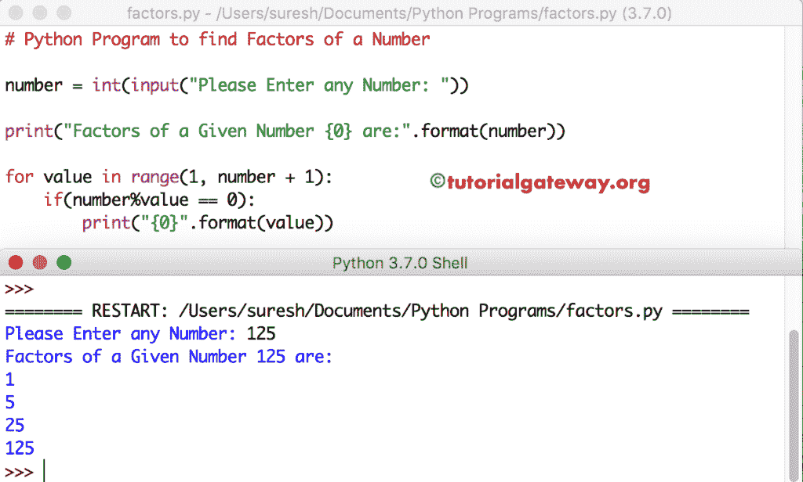

# Python 程序：寻找数字因子

> 原文：<https://www.tutorialgateway.org/python-program-to-find-factors-of-a-number/>

编写一个 Python 程序，使用 While 循环、For 循环和带有示例的函数来查找一个数的因子。

## 使用 While 循环查找一个数的因子的 Python 程序

这个 Python 程序允许用户输入任何整数值。接下来，这个 Python 程序使用 While 循环找到这个数字的因子。记住，可以被给定整数整除的整数(它意味着余数= 0)称为因子。

```py
number = int(input("Please Enter any Number: "))

value = 1
print("Factors of a Given Number {0} are:".format(number))

while (value <= number):
    if(number % value == 0):
        print("{0}".format(value))
    value = value + 1
```

```py
Please Enter any Number: 4
Factors of a Given Number 4 are:
1
2
4
```

在 [Python](https://www.tutorialgateway.org/python-tutorial/) while 循环中，有一个 [If 语句](https://www.tutorialgateway.org/python-if-statement/)来检查被值整除的数字是否正好等于 0。如果为真，它将打印该整数。否则，它会跳过该整数并检查下一个整数。这里，数字= 4，数值= 1

第一次迭代
(值< =数字)–表示(1 < = 4)为真
现在，检查 if 条件
if(数字%值= = 0)=>(4% 1 = = 0)–该条件为真。所以，1 打印

价值=价值+1–意味着价值变成 2

第二次迭代
值= 2，数字= 4–如果(4% 2 = = 0)–该条件为真，则表示(2 < = 4)为真
。所以，打印了 2 张

第三次迭代
值= 3，数字= 4–如果(3% 2 = = 0)–条件为 FLASE，则表示(3 < = 4)为真
。所以，跳过 3 个

第四次迭代
i = 4，Number = 4–如果(4% 4 = = 0)–条件为真，则表示(4 < = 4)为真
。4 印

接下来，值变为 5–表示条件(5 <= 4)为假。所以，循环终止。给定 4 的因子= 1，2，4。

## 使用 For 循环寻找一个数的因子的 Python 程序

在一个数字程序的这些因素中，我们只是将 [While Loop](https://www.tutorialgateway.org/python-while-loop/) 替换为 [For Loop](https://www.tutorialgateway.org/python-for-loop/) 。

```py
number = int(input("Please Enter any Number: "))

print("Factors of a Given Number {0} are:".format(number))

for value in range(1, number + 1):
    if(number%value == 0):
        print("{0}".format(value))
```



## 用函数求数的因子的 Python 程序

这个 Python 因子的一个数字程序与上面的例子相同。但是在这个 [Python 程序](https://www.tutorialgateway.org/python-programming-examples/)中，我们通过定义一个名为 Find_factors 的新函数来分离因子逻辑。

 ```py
def Find_Factors(number):
    for value in range(1, number + 1):
        if(number % value == 0):
            print("{0}".format(value))

num = int(input("Please Enter any Number: "))

print("Factors of a Given Number {0} are:".format(num))
Find_Factors(num)
```

```py
Please Enter any Number: 222
Factors of a Given Number 222 are:
1
2
3
6
37
74
111
222
```