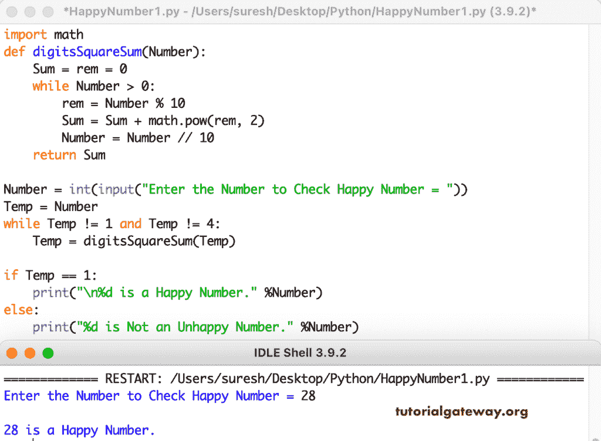

# Python 程序：检查数字是否是幸福数

> 原文：<https://www.tutorialgateway.org/python-program-to-check-the-number-is-a-happy-number/>

写一个 Python 程序来检查这个数字是一个快乐的数字还是没有用于循环。如果一个数中个别数字的平方的重复和等于 1，则它是一个幸福数。例如，28 是一个快乐的数字，因为

22 + 82 = 4 + 64 = 68

62 + 82 = 36 + 64 = 100

12 + 02 + 02 = 1

```py
import math

def digitsSquareSum(Number):
    Sum = rem = 0
    while Number > 0:
        rem = Number % 10
        Sum = Sum + math.pow(rem, 2)
        Number = Number // 10
    return Sum

Number = int(input("Enter the Number to Check Happy Number = "))
Temp = Number

while Temp != 1 and Temp != 4:
    Temp = digitsSquareSum(Temp)

if Temp == 1:
    print("\n%d is a Happy Number." %Number)
else:
    print("%d is Not an Unhappy Number." %Number)
```

